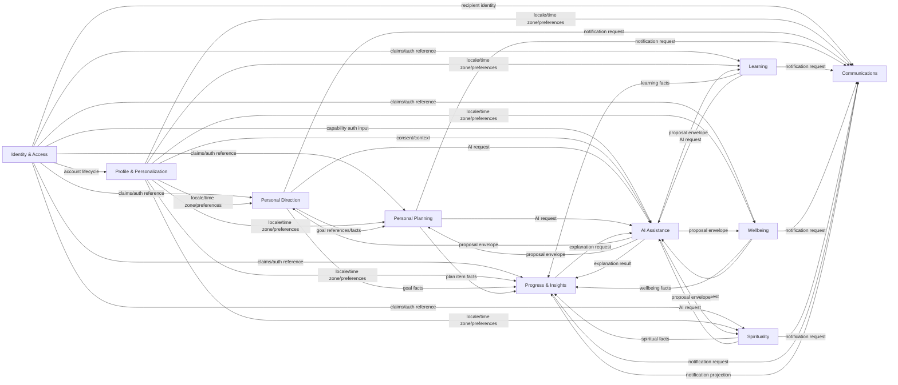

# LifePilot AI - Bounded Contexts and Context Map

**Status:** Milestone 0.2 draft for Product Owner approval.  
**Purpose:** Define the official Domain-Driven Design bounded-context architecture for LifePilot AI before aggregate design or implementation.  
**Scope:** Version 1 personal consumer product only. Future multi-tenancy and enterprise readiness are architectural constraints, not Version 1 product behavior.  
**Input sources:** Approved Product Charter decisions from the conversation, accepted ADRs, Event Storming Baseline, Domain Decomposition Analysis, and Ubiquitous Language Dictionary. No new product requirements are introduced in this document.

## 1. Binding Context Decisions

The approved product module list is retained as the user-facing release map:

- User Profile
- Goals
- Study AI
- External Courses
- Gym AI
- Nutrition AI
- Islamic AI
- Language Learning
- Life Planner
- Progress Tracking
- Dashboard
- AI Copilot

The official DDD bounded-context map is not one-to-one with those modules. The approved domain decomposition redesigns LifePilot AI into the following bounded contexts:

| Bounded Context | DDD Category | Product modules served | Ownership decision |
|---|---|---|---|
| Identity & Access | Generic | User Profile, Admin access | Accounts, credentials, refresh tokens, roles, permissions, external login. |
| Profile & Personalization | Supporting | User Profile | Locale, time zone, preferences, profile completeness, consent references. |
| Personal Direction | Core | Goals | Goals, milestones, goal lifecycle, goal-owned completion facts. |
| Personal Planning | Core | Life Planner | Life plans, daily plans, plan items, ordering, user-confirmed completion/skip state. |
| Learning | Supporting | Study AI, External Courses, Language Learning | Study workspaces, materials, study sessions, external courses, enrollments, language learning records. |
| Wellbeing | Supporting | Gym AI, Nutrition AI | Body measurements, nutrition profile, meal records, meal plans, fitness profile, workout programs, workout sessions. |
| Spirituality | Core | Islamic AI | Spiritual preferences, prayer progress, spiritual plans, approved Islamic assistance metadata. |
| Progress & Insights | Core | Progress Tracking, Dashboard | Progress ledger, deterministic metrics, summaries, insights, dashboard projections. |
| AI Assistance | Supporting | AI Copilot and AI features in all modules | AI request lifecycle, provider-independent gateway governance, proposal envelopes, usage records. |
| Communications | Generic | Notifications across product | Durable notifications, in-app notification state, email dispatch requests, delivery outcomes. |

**Design correction:** Dashboard is not a source-of-truth bounded context. It is an authorized projection capability owned by Progress & Insights. AI is not a domain owner; AI Assistance governs provider-independent execution and returns advisory/proposal outputs to the target domain.

## 2. Context Catalog

### 2.1 Identity & Access

| Area | Definition |
|---|---|
| Purpose | Authenticate users and protect access to LifePilot AI. |
| Business Responsibility | Own account identity, login methods, refresh-token sessions, email verification, password reset, roles, permissions, account disable/restore, and security audit triggers. |
| Owned Aggregates | User Account, Refresh Token Session, External Login Link, Role Assignment. |
| Owned Entities | Email Credential, Refresh Token, Google Login Link, Role Assignment Record, Verification Token, Password Reset Token. |
| Owned Value Objects | UserId, EmailAddress, PasswordHash, TokenHash, RoleName, PermissionCode, AccountStatus, VerificationStatus. |
| Domain Services | Account registration policy, credential validation policy, token rotation policy, role/permission authorization policy, account lifecycle policy. |
| Domain Events | UserRegistered, GoogleAccountLinked, EmailVerificationRequested, EmailVerified, PasswordResetRequested, PasswordResetCompleted, RefreshTokenIssued, RefreshTokenRotated, RefreshTokenRevoked, AccountDisabled, AccountRestored, AccountDeleted, RoleAssigned, RoleRevoked. |
| Policies | Unique normalized email, verified-email access gates, refresh-token rotation, role assignment audit, support/admin access audit. |
| Invariants | Email identity must be unique under approved normalization; refresh tokens are never stored in plain text; disabled accounts cannot authenticate; role changes require authorization and audit. |
| Read Models | Account Security Status, Current User Claims, Admin Account Summary, Active Sessions, Role Assignment View. |
| External Dependencies | Google OAuth, email delivery via Communications, JWT signing infrastructure. |
| Published Events | account.registered.v1, account.email-verified.v1, account.disabled.v1, account.restored.v1, account.deleted.v1, role.assigned.v1, role.revoked.v1. |
| Consumed Events | None for core account ownership. May consume notification-delivery outcomes for operational display only. |
| Public Interfaces | Authentication commands, token refresh command, email verification command, password reset commands, authorization claims contract, account lifecycle integration events. |
| Internal Rules | Credential, token, and role data cannot be read or written by Profile or product contexts. Authorization checks must not depend on Dashboard, AI, or source-domain state unless an approved entitlement policy exists. |
| Future Split Readiness | Medium. Extractable after identity provider contracts, account linking, and authorization claims are stable. |
| Data Ownership | Sole owner of account identity, credentials, refresh tokens, roles, and permissions. |
| Security Boundary | Highest security boundary. Owns authentication, authorization primitives, token secrecy, role mutation, and account security auditing. |
| AI Boundary | No AI usage for authentication, authorization, credentials, role assignment, or account security decisions. |
| Background Jobs | Verification-token cleanup, password-reset-token cleanup, refresh-token cleanup, account-deletion execution after approved retention policy. |

### 2.2 Profile & Personalization

| Area | Definition |
|---|---|
| Purpose | Represent the user's personal preferences and localization context. |
| Business Responsibility | Own profile completion, display profile, Arabic/English locale, RTL/LTR direction derivation, time zone preference, user preferences, and approved consent references. |
| Owned Aggregates | Profile, User Preferences, Consent Record where approved. |
| Owned Entities | Preference Entry, Consent Record, Profile Completion State. |
| Owned Value Objects | Locale, TextDirection, TimeZoneId, DisplayName, PreferenceKey, ConsentStatus. |
| Domain Services | Profile completeness evaluator, locale validator, time-zone validator, privacy-preference policy. |
| Domain Events | ProfileCreated, ProfileCompleted, ProfileUpdated, UserLocaleChanged, UserTimeZoneChanged, UserPreferencesUpdated, ConsentRecorded, ConsentWithdrawn. |
| Policies | Locale must be Arabic or English in Version 1; text direction is derived from locale; profile changes are owner-only except approved audited support access. |
| Invariants | Profile belongs to exactly one UserId; profile cannot store credentials, refresh tokens, roles, body measurements, goals, plans, or progress source data. |
| Read Models | My Profile, Profile Completeness, Localization Preferences, Privacy Preference Summary. |
| External Dependencies | Identity & Access for UserId and account lifecycle; Azure Blob only if profile media is later approved. |
| Published Events | profile.created.v1, profile.completed.v1, profile.preferences-updated.v1, profile.locale-changed.v1, profile.time-zone-changed.v1. |
| Consumed Events | account.registered.v1, account.deleted.v1. |
| Public Interfaces | Profile commands, preference commands, localized profile read contract, profile lifecycle events. |
| Internal Rules | Body measurements belong to Wellbeing; account state belongs to Identity & Access; profile read contracts expose only stable, approved preference data. |
| Future Split Readiness | High. Narrow ownership and stable event contracts make extraction straightforward. |
| Data Ownership | Sole owner of profile and preference data. Other contexts may store immutable profile references or denormalized read projections only. |
| Security Boundary | Owner-private by default; support access requires audited authorization. |
| AI Boundary | AI does not modify profile, locale, time zone, or consent. |
| Background Jobs | Profile deletion handling after account deletion policy; preference projection rebuild where needed. |

### 2.3 Personal Direction

| Area | Definition |
|---|---|
| Purpose | Capture and govern the user's desired outcomes. |
| Business Responsibility | Own goals, milestones, goal lifecycle, goal progress facts, and goal archival/completion rules. |
| Owned Aggregates | Goal. |
| Owned Entities | Goal Milestone, Goal Progress Record. |
| Owned Value Objects | GoalId, GoalTitle, GoalDescription, GoalStatus, GoalReference, MilestoneId, GoalDueDate where approved. |
| Domain Services | Goal state-transition policy, goal progress evaluator, goal archival policy, AI goal proposal validator. |
| Domain Events | GoalCreated, GoalUpdated, GoalMilestoneAdded, GoalMilestoneUpdated, GoalProgressRecorded, GoalPaused, GoalResumed, GoalCompleted, GoalArchived, GoalChangeProposalApplied, GoalChangeProposalRejected. |
| Policies | Only the owning user may mutate a goal; completed or archived goals cannot accept progress unless a reopen policy is approved; AI can recommend changes but cannot complete or mutate a goal directly. |
| Invariants | Goal belongs to exactly one user; goal lifecycle transitions must be deterministic; plan items reference goals by GoalReference only; Progress cannot mutate goals. |
| Read Models | Goal List, Goal Detail, Active Goals, Goal Timeline, Goal Progress Summary. |
| External Dependencies | Identity & Access, Profile & Personalization, AI Assistance for advisory recommendations, Communications for approved notification requests. |
| Published Events | goal.created.v1, goal.updated.v1, goal.progress-recorded.v1, goal.completed.v1, goal.archived.v1, goal.change-proposal-applied.v1. |
| Consumed Events | profile.preferences-updated.v1 only for localized display/projection needs; ai.proposal-generated.v1 through application command flow only when target is Goal. |
| Public Interfaces | Goal command API through MediatR, GoalReference contract, goal fact integration events, goal read models. |
| Internal Rules | Goal status and completion are not computed by Dashboard, Planner, Progress, or AI. Goal-owned data cannot be directly updated from another context. |
| Future Split Readiness | Medium-high. Requires stable GoalReference and event contracts. |
| Data Ownership | Sole owner of goal and milestone source state. |
| Security Boundary | User-owned private business data; admin cannot directly edit goals without an approved support policy. |
| AI Boundary | AI may summarize, explain, recommend, or propose goal changes; deterministic goal commands validate and apply any accepted proposal. |
| Background Jobs | Optional due-date evaluation only after due-date policy is approved; AI recommendation jobs through AI Assistance. |

### 2.4 Personal Planning

| Area | Definition |
|---|---|
| Purpose | Convert user intent into user-controlled daily action. |
| Business Responsibility | Own life plans, daily plans, plan items, ordering, and user-confirmed plan item completion/skip state. |
| Owned Aggregates | Life Plan, Daily Plan. |
| Owned Entities | Plan Item, Plan Template only if later approved. |
| Owned Value Objects | DailyPlanId, PlanItemId, PlanItemStatus, PlanItemOrder, GoalReference, PlanDate, TimeWindow where approved. |
| Domain Services | Plan-item transition policy, plan conflict validator, plan proposal validator, rollover policy only if approved. |
| Domain Events | LifePlanCreated, DailyPlanCreated, PlanItemAdded, PlanItemUpdated, PlanItemReordered, PlanItemCompleted, PlanItemSkipped, PlanItemRemoved, PlanRecommendationGenerated, PlanProposalApplied, PlanProposalRejected. |
| Policies | AI never schedules independently; scheduling, recurrence, time blocks, priorities, rollover, reminders, and calendar integration remain pending requirements; completion/skip are deterministic user or approved system actions. |
| Invariants | Daily Plan belongs to one user and one user-visible day; plan item order is consistent within a Daily Plan; plan items may reference but cannot mutate goals or specialized domain plans. |
| Read Models | Today View, Daily Plan Detail, Upcoming Plans, Plan Item Timeline, Planning History. |
| External Dependencies | Identity & Access, Profile & Personalization, Personal Direction by GoalReference, AI Assistance, Communications. |
| Published Events | planner.daily-plan-created.v1, planner.plan-item-completed.v1, planner.plan-item-skipped.v1, planner.plan-proposal-applied.v1. |
| Consumed Events | goal.created.v1 and goal.archived.v1 for reference validation/projections; profile.preferences-updated.v1 for localized views; ai.proposal-generated.v1 through target command flow. |
| Public Interfaces | Daily Plan command API, PlanItem command API, GoalReference consumption contract, planner integration events. |
| Internal Rules | Cross-domain daily scheduling belongs here, but specialized plan content remains in Learning, Wellbeing, or Spirituality. Planner cannot directly write specialized source records. |
| Future Split Readiness | High after scheduling and recurrence rules are approved. |
| Data Ownership | Sole owner of Daily Plan and Plan Item source state. |
| Security Boundary | User-owned private planning data; all changes require owner authorization. |
| AI Boundary | AI may propose modifications to an existing plan only; planner validates and applies accepted proposals. AI cannot schedule, mark completion, or enforce planning rules. |
| Background Jobs | Approved reminder evaluation, deterministic rollover, and projection rebuild only after policies are approved. |

### 2.5 Learning

| Area | Definition |
|---|---|
| Purpose | Support user-owned learning activity across study, external courses, and language learning. |
| Business Responsibility | Own study workspaces, study material metadata, study processing state, study sessions, external courses, course enrollments, course progress records, language learning plans, language sessions, and vocabulary state where approved. |
| Owned Aggregates | Study Workspace, Study Material, Study Session, External Course, Course Enrollment, Language Learning Profile, Learning Plan, Learning Session, Vocabulary Item where approved. |
| Owned Entities | Study Material Processing Record, Course Progress Record, Language Session Record, Vocabulary Progress Record. |
| Owned Value Objects | StudyWorkspaceId, StudyMaterialId, CourseReference, CourseEnrollmentId, Subject, LanguageCode, LearningLevel where approved, MaterialStorageReference. |
| Domain Services | Study-material access policy, course reference validator, enrollment ownership policy, language-level validation, learning-progress policy, AI learning proposal validator. |
| Domain Events | StudyWorkspaceCreated, StudyMaterialUploaded, StudyMaterialRejected, StudyMaterialProcessed, StudyMaterialProcessingFailed, StudySessionStarted, StudySessionCompleted, ExternalCourseAdded, CourseEnrollmentCreated, CourseProgressRecorded, CourseCompleted, CourseArchived, LanguageLearningProfileConfigured, LearningPlanCreated, LearningPlanUpdated, LearningSessionStarted, LearningSessionCompleted, VocabularyItemAdded, VocabularyProgressRecorded, LearningPlanProposalApplied. |
| Policies | Learning data belongs to the owner; OCR provider, upload types, file size, malware scanning, retention, curriculum, dictionary/speech/translation providers, assessments, and repetition algorithms require approval; AI cannot assert completion or proficiency. |
| Invariants | Study materials belong to one authorized workspace; external course completion is user-declared unless provider integration is approved; language progress is deterministic under approved rules; material content is not shared through integration events. |
| Read Models | Study Workspace Detail, Material Library, Processing Status, Summary Library, Study Session History, Course Library, Active Enrollments, Course Detail, Course Progress Summary, Learning Profile, Active Learning Plan, Session History, Vocabulary Review List, Learning Progress Summary. |
| External Dependencies | Azure Blob Storage, optional OCR only when approved, AI Assistance, Communications. No external course provider is approved. |
| Published Events | study.material-processed.v1, study.session-completed.v1, course.enrolled.v1, course.progress-recorded.v1, course.completed.v1, language.session-completed.v1, language.vocabulary-progress-recorded.v1, learning.plan-proposal-applied.v1. |
| Consumed Events | profile.preferences-updated.v1 for locale/time zone display; planner events only as references/projections where an activity is planned; ai.proposal-generated.v1 through target command flow. |
| Public Interfaces | Learning command API, material processing status API, course tracking API, language learning API, learning fact integration events. |
| Internal Rules | Learning owns learning records, not Progress summaries, Dashboard widgets, AI governance, Blob implementation, or daily scheduling. |
| Future Split Readiness | Medium. Study/OCR and language provider workloads may later justify separate extraction after requirements stabilize. |
| Data Ownership | Sole owner of study material metadata, course tracking state, study sessions, language sessions, and learning plan source state. Blob stores content but does not own domain data. |
| Security Boundary | User-private learning data; study material content must be minimized in logs/events and never exposed to unauthorized consumers. |
| AI Boundary | AI may summarize, explain, answer questions, generate learning content, recommend, or propose learning-plan modifications. Learning validates and applies accepted proposals. |
| Background Jobs | Material processing, optional OCR, text extraction, AI generation requests, processing notifications, projection rebuilds. |

### 2.6 Wellbeing

| Area | Definition |
|---|---|
| Purpose | Support private health-related self-management through nutrition and fitness without medical authority. |
| Business Responsibility | Own body measurements, nutrition profile, meal records, nutrition plans, fitness profile, workout programs, workout sessions, exercises, and workout history. |
| Owned Aggregates | Wellbeing Profile, Body Measurement Record, Nutrition Profile, Meal Record, Meal Plan, Fitness Profile, Workout Program, Workout Session. |
| Owned Entities | Exercise Record, Meal Entry, Measurement Entry, Plan Proposal Application Record. |
| Owned Value Objects | Weight, Height, MeasurementUnit, MeasurementInstant, MealId, WorkoutSessionId, ExerciseReference, MuscleGroup, NutritionMeasurement where approved. |
| Domain Services | Measurement validation, deterministic nutrition record policy, workout state-transition policy, safety-disclaimer policy, wellbeing AI proposal validator. |
| Domain Events | WellbeingProfileUpdated, BodyMeasurementRecorded, BodyMeasurementCorrected, NutritionProfileCreated, NutritionProfileUpdated, MealRecorded, MealRecordUpdated, MealRecordRemoved, NutritionPlanCreated, NutritionPlanUpdated, NutritionPlanProposalApplied, FitnessProfileCreated, FitnessProfileUpdated, WorkoutPlanCreated, WorkoutPlanUpdated, WorkoutSessionStarted, ExerciseRecorded, WorkoutSessionCompleted, WorkoutPlanProposalApplied. |
| Policies | Wellbeing data is sensitive and private by default; AI cannot diagnose, prescribe, calculate authoritative measurements, or independently alter plans; food data, allergies, medical exclusions, age restrictions, exercise catalog, device integrations, and safety rules require approval. |
| Invariants | Body measurements have one owner: Wellbeing; Profile, Nutrition, and Gym must not duplicate measurement ownership; workout completion is user-recorded/deterministic; nutrition measurements require approved calculation/source rules before use. |
| Read Models | Wellbeing Profile, Body Measurement History, Nutrition Profile, Meal History, Nutrition Plan Detail, Nutrition Progress Summary, Fitness Profile, Active Workout Program, Workout Session Detail, Workout History, Fitness Progress Summary. |
| External Dependencies | AI Assistance, Communications. No food database, wearable, medical provider, or gym platform is approved. |
| Published Events | wellbeing.body-measurement-recorded.v1, nutrition.meal-recorded.v1, nutrition.plan-updated.v1, nutrition.plan-proposal-applied.v1, workout.session-completed.v1, workout.plan-updated.v1, workout.plan-proposal-applied.v1. |
| Consumed Events | profile.preferences-updated.v1 for locale/time zone/units display; planner events only as planning references; ai.proposal-generated.v1 through target command flow. |
| Public Interfaces | Body measurement commands, nutrition commands, workout commands, wellbeing fact integration events, authorized wellbeing read contracts. |
| Internal Rules | Wellbeing does not own medical diagnosis, global profile preferences, progress scoring, notification delivery, or AI provider routing. |
| Future Split Readiness | Medium. Nutrition and fitness may split later only after shared Wellbeing Profile and measurement contracts are stable. |
| Data Ownership | Sole owner of sensitive wellbeing measurements, nutrition records, workout records, and wellbeing plan source state. |
| Security Boundary | Sensitive personal data boundary. Requires strict authorization, minimized logging/events, audit for sensitive access where approved, and no unauthorized cross-context writes. |
| AI Boundary | AI may explain, recommend, generate content, or propose modifications. Deterministic Wellbeing commands validate and apply proposals. AI cannot calculate authoritative nutrition/fitness/body values. |
| Background Jobs | AI recommendation/proposal work, approved reminders, projection rebuilds. Device import and food database synchronization are not approved. |

### 2.7 Spirituality

| Area | Definition |
|---|---|
| Purpose | Support private spiritual progress and culturally respectful Islamic assistance. |
| Business Responsibility | Own spiritual preferences, prayer progress, spiritual plans, and spiritual content interaction metadata. |
| Owned Aggregates | Spiritual Profile, Prayer Progress Record, Spiritual Plan. |
| Owned Entities | Prayer Progress Entry, Spiritual Plan Item, Islamic Content Interaction where approved. |
| Owned Value Objects | PrayerReference, PrayerProgressStatus where approved, SpiritualPlanId, SpiritualPreference, PrayerTimeData only if deterministic source is approved. |
| Domain Services | Spiritual content safety policy, prayer progress policy, spiritual plan proposal validator, prayer-time data policy only if approved. |
| Domain Events | SpiritualProfileConfigured, PrayerProgressRecorded, PrayerProgressUpdated, IslamicQuestionAsked, IslamicAnswerGenerated, IslamicExplanationRequested, IslamicExplanationGenerated, SpiritualRecommendationGenerated, SpiritualPlanCreated, SpiritualPlanModificationProposed, SpiritualPlanProposalApplied, PrayerTimeDataUpdated only if approved. |
| Policies | Prayer progress is self-reported private data; AI must not claim religious authority, issue binding rulings, or calculate prayer times; prayer-time behavior requires approved deterministic source, location consent, convention, and override policy. |
| Invariants | Spiritual records belong to exactly one user; AI answers cannot become authoritative rulings; prayer-time data cannot exist without approved deterministic method/provider. |
| Read Models | Spiritual Preferences, Prayer Progress Calendar, Spiritual Plan, Islamic Content History, Spiritual Progress Summary. |
| External Dependencies | AI Assistance, Communications, deterministic prayer-time service only if approved. |
| Published Events | spiritual.profile-configured.v1, spiritual.prayer-progress-recorded.v1, spiritual.prayer-progress-updated.v1, spiritual.plan-updated.v1. |
| Consumed Events | profile.preferences-updated.v1 for locale/time zone display; ai.proposal-generated.v1 through target command flow. |
| Public Interfaces | Spiritual preference commands, prayer progress commands, spiritual plan commands, spiritual fact integration events. |
| Internal Rules | Spirituality owns spiritual records, not global profile settings, AI provider governance, Progress scoring, or notification delivery. |
| Future Split Readiness | Medium-high because cultural governance and future prayer-time workload may justify isolation. |
| Data Ownership | Sole owner of spiritual progress source data and spiritual plan state. |
| Security Boundary | Private personal spiritual data. Cross-context events must minimize sensitive content. |
| AI Boundary | AI may explain, answer, generate content, recommend, or propose modifications under approved governance. It cannot calculate prayer times, issue binding rulings, or mutate spiritual records. |
| Background Jobs | AI answer/explanation work, approved prayer-time refresh only after source approval, approved reminders only after notification rules are approved. |

### 2.8 Progress & Insights

| Area | Definition |
|---|---|
| Purpose | Create deterministic cross-domain progress, insights, and dashboard projections from source-domain facts. |
| Business Responsibility | Own progress ledger, metric definitions, derived summaries, reconciliation, deterministic statistics, insight projections, dashboard projections, and projection freshness metadata. |
| Owned Aggregates | Progress Ledger, Progress Metric Definition where approved. |
| Owned Entities | Progress Fact, Progress Summary, Metric Period, Reconciliation Record, Dashboard Widget Projection. |
| Owned Value Objects | SourceEventId, MetricCode, MetricPeriod, ProgressPercentage, CompletionCount, FreshnessMarker, InsightSource. |
| Domain Services | Deterministic progress calculation service, metric validation service, progress reconciliation service, dashboard composition policy. |
| Domain Events | ProgressFactRecorded, ProgressMetricUpdated, ProgressSummaryUpdated, ProgressProjectionRebuilt, ProgressDiscrepancyDetected, ProgressDiscrepancyResolved, DashboardProjectionUpdated, DashboardProjectionRebuilt, DashboardDataUnavailable, ProgressExplanationGenerated. |
| Policies | Progress consumes approved immutable source facts only; source corrections must originate in the source context; AI cannot calculate authoritative progress; Dashboard cannot become source of truth. |
| Invariants | A progress fact references exactly one source event; derived summaries are replaceable; every metric must have approved deterministic definition before use; read models are owned by exactly one projection owner. |
| Read Models | Daily Progress, Weekly Progress, Monthly Progress, Area Progress Summary, Goal Progress Summary, Activity Timeline, Personal Dashboard, Today Summary, Progress Widgets, Notification Feed projection reference, Dashboard Preferences if approved. |
| External Dependencies | Source-context integration events, Profile for locale/time-zone display, AI Assistance for explanation only, Communications for notification feed display. |
| Published Events | progress.fact-recorded.v1, progress.summary-updated.v1, progress.discrepancy-detected.v1, dashboard.projection-updated.v1 only if future consumers require it. |
| Consumed Events | goal.* facts, planner.* facts, study.* facts, course.* facts, language.* facts, wellbeing.* facts, nutrition.* facts, workout.* facts, spiritual.* facts, notification read events for dashboard feed only. |
| Public Interfaces | Progress read APIs, dashboard read APIs, progress fact ingestion contract, projection rebuild/reconciliation commands for authorized operations. |
| Internal Rules | Progress cannot mutate source aggregates; Dashboard cannot recalculate source values; AI explanations must cite deterministic source summaries. |
| Future Split Readiness | High for Progress. Dashboard should remain projection/API composition unless traffic requires a read-model service. |
| Data Ownership | Sole owner of derived progress ledger, metric outputs, insight projections, and dashboard projections. Does not own source facts. |
| Security Boundary | Aggregates sensitive facts from all domains; must enforce strict owner authorization, feature flags, locale, and privacy-aware widget selection. |
| AI Boundary | AI may explain or summarize progress but cannot calculate, correct, or write authoritative progress. |
| Background Jobs | Projection updates, replay/rebuild, reconciliation, period rollups after metric definitions are approved. |

### 2.9 AI Assistance

| Area | Definition |
|---|---|
| Purpose | Govern provider-independent AI assistance safely across LifePilot AI. |
| Business Responsibility | Own AI request lifecycle, capability authorization, redaction metadata, provider selection, response/proposal envelopes, usage/quota records, failure records, and applied-proposal audit links. |
| Owned Aggregates | AI Request Record, Copilot Session where retention is approved, AI Proposal Record, AI Usage Record. |
| Owned Entities | AI Capability Request, Provider Attempt, Redaction Record, Proposal Envelope, Usage Counter, Applied Proposal Link. |
| Owned Value Objects | AICapability, ProviderCode, PromptClassification, RedactionOutcome, CorrelationId, TargetAggregateReference, TokenUsage, CostMetadata where approved. |
| Domain Services | AI capability authorization, prompt-data minimization, provider selection policy, provider fallback policy where approved, quota/entitlement policy, proposal envelope validator. |
| Domain Events | CopilotSessionStarted, CopilotQuestionSubmitted, AIRequestAuthorized, AIRequestRejectedByPolicy, AIRequestRedacted, AIProviderSelected, AIResponseGenerated, AIResponseFailed, AIQuotaExceeded, AIProposalGenerated, AIProposalApplied, AIProposalRejected, CopilotSessionDeleted. |
| Policies | AI may summarize, explain, answer questions, recommend, generate content, and propose modifications to existing plans; AI must never calculate, schedule, manage business rules, grant access, or directly write business state. |
| Invariants | Every AI request is associated with an authenticated user, approved capability, minimum necessary context, provider-neutral result, and correlation ID; every state-changing proposal must be accepted by the target context command. |
| Read Models | Copilot Session History if retention approved, AI Request Status, User AI Usage, Proposal Review, Provider Reliability Summary. |
| External Dependencies | OpenAI, Google Gemini, Claude, Redis/rate limiting, observability, target domains by public contracts only. |
| Published Events | ai.response-generated.v1, ai.response-failed.v1, ai.proposal-generated.v1, ai.proposal-applied.v1, ai.quota-exceeded.v1. |
| Consumed Events | account and profile reference events for authorization/context; target-domain request commands/events only through explicit application workflows. |
| Public Interfaces | AI Gateway application contract, Copilot commands, provider-neutral AI response contract, proposal envelope contract, AI usage read model. |
| Internal Rules | Provider SDKs cannot be called directly from feature handlers/controllers; prompt content is not a domain contract; raw sensitive data must not be logged; target domains own all business validation. |
| Future Split Readiness | Medium-high. Likely future platform service after policy, retention, cost, and quota rules stabilize. |
| Data Ownership | Sole owner of AI request metadata, provider attempt metadata, usage records, and proposal envelopes before application. Target domains own accepted business state. |
| Security Boundary | High privacy boundary. Enforces least-data processing, provider policy, request auditing, usage limits, and safe failure behavior. |
| AI Boundary | This context is the only gateway to AI providers. It does not own target business rules. |
| Background Jobs | Provider calls, retries/fallback where approved, asynchronous generation, usage reconciliation, quota reset after entitlement policy approval. |

### 2.10 Communications

| Area | Definition |
|---|---|
| Purpose | Deliver durable user notifications through approved channels. |
| Business Responsibility | Own notification records, in-app notification state, email delivery jobs, delivery outcomes, notification preferences where approved, and SignalR delivery status. |
| Owned Aggregates | Notification, Notification Preference where approved. |
| Owned Entities | Notification Delivery Attempt, Email Dispatch Record, In-App Notification State. |
| Owned Value Objects | NotificationId, TemplateKey, DeliveryChannel, DeliveryStatus, RecipientReference, SafeTemplateParameter, Urgency. |
| Domain Services | Notification eligibility policy, template rendering policy, delivery preference policy, email dispatch policy. |
| Domain Events | NotificationCreated, InAppNotificationCreated, NotificationDelivered, NotificationRead, NotificationDeliveryFailed, EmailQueued, EmailSent, EmailFailed, ReminderEligible where approved. |
| Policies | In-app history is durable; SignalR is delivery only; email is background work; reminders require approved consent, timing, quiet-hours, and frequency rules. |
| Invariants | Notification has one owning recipient; notification content uses safe template parameters; delivery state belongs to Communications; business domains do not directly send email or SignalR messages. |
| Read Models | Notification Feed, Unread Count, Delivery Status, Email Dispatch History, Notification Preferences where approved. |
| External Dependencies | Email provider, SignalR, Hangfire, Profile for locale/time-zone/preferences, Identity & Access for recipient validity. |
| Published Events | notification.created.v1, notification.delivered.v1, notification.read.v1, notification.delivery-failed.v1, email.sent.v1, email.failed.v1. |
| Consumed Events | account.email-verification-requested.v1, account.password-reset-requested.v1, source business events or notification-request contracts from approved domains, profile.preferences-updated.v1. |
| Public Interfaces | Notification request contract, notification feed API, read/mark-read command, email dispatch integration, delivery outcome events. |
| Internal Rules | Communications owns delivery and persistence, not the source business meaning that caused the notification. Source contexts publish facts or request notifications using safe parameters. |
| Future Split Readiness | High. Notification volume/channel expansion can justify separate service after consent and delivery-provider policies stabilize. |
| Data Ownership | Sole owner of notification records and delivery state. Source domains own their original business facts. |
| Security Boundary | Must prevent cross-user notification access and avoid sensitive raw data in templates/events. |
| AI Boundary | AI does not create notifications directly. AI may only cause notification requests through approved target-domain workflows. |
| Background Jobs | Email dispatch, delivery retry, expiration, cleanup, SignalR fallback handling, approved reminder processing. |

## 3. Context Map

### Context Dependency Graph

The graph is intentionally acyclic for state ownership:

1. Identity & Access is upstream for identity, authorization claims, roles, and account lifecycle.
2. Profile & Personalization is downstream of Identity & Access and upstream for locale, time zone, and approved user preferences.
3. Personal Direction is upstream of Personal Planning through GoalReference and goal facts.
4. Personal Direction, Personal Planning, Learning, Wellbeing, and Spirituality are upstream of Progress & Insights through immutable facts.
5. Progress & Insights is upstream of Dashboard projections and downstream consumers of summaries.
6. Communications consumes notification requests and publishes delivery/read events. Its feed may be displayed by Dashboard, but it does not create source business facts.
7. AI Assistance is an application capability dependency, not a business-state owner of target contexts. It returns proposal envelopes; target contexts validate and apply.

No context may depend on another context's internal database, repository, aggregate, entity type, or mutable state.

## 4. Relationship Types

### Upstream / Downstream Relationships

| Upstream | Downstream | Relationship | Contract |
|---|---|---|---|
| Identity & Access | All contexts | Supplier | UserId, claims, account lifecycle events. |
| Profile & Personalization | All user-owned contexts | Supplier | Locale, time zone, approved preferences, consent references. |
| Personal Direction | Personal Planning | Customer/Supplier | GoalReference and goal lifecycle facts. |
| Personal Direction | Progress & Insights | Customer/Supplier | Goal progress and completion facts. |
| Personal Planning | Progress & Insights | Customer/Supplier | Daily plan and plan item completion/skip facts. |
| Learning | Progress & Insights | Customer/Supplier | Study, course, language activity facts. |
| Wellbeing | Progress & Insights | Customer/Supplier | Measurement, meal, workout activity facts. |
| Spirituality | Progress & Insights | Customer/Supplier | Prayer and spiritual activity facts. |
| Source contexts | Communications | Customer/Supplier | Notification request contract. |
| AI Assistance | Target contexts | Open Host Service plus ACL | Provider-neutral AI result/proposal envelope. |
| Progress & Insights | Presentation/Dashboard clients | Open Host Service | Authorized dashboard and progress read models. |

### Shared Kernel

The Shared Kernel must be intentionally tiny and stable:

| Shared Concept | Allowed Contents | Forbidden Contents |
|---|---|---|
| UserId | Stable identity reference. | Account credentials, profile data, role assignment state. |
| CorrelationId | Request/job/event tracing reference. | Business meaning or authorization authority. |
| UTC Instant | Stored timestamp. | User-visible time-zone logic embedded in source domains. |
| Locale and Text Direction codes | Approved Arabic/English localization identifiers. | Translated text, business rules, UI labels. |
| Domain identifiers | GoalId, PlanItemId, StudyMaterialId, etc. as references. | Foreign aggregate instances or mutable state. |
| Integration event envelope | Event id, type, version, occurred-at UTC, correlation id. | Raw sensitive payloads, provider prompts, tokens. |

There is no shared mutable business entity. Shared Kernel must not become a dumping ground for common entities such as Plan, Progress, Profile, or Notification.

### Customer/Supplier Relationships

| Customer | Supplier | Expectation |
|---|---|---|
| Profile & Personalization | Identity & Access | Receives account lifecycle facts to create/delete profile records. |
| Personal Planning | Personal Direction | References goals without owning or mutating them. |
| Progress & Insights | Source domains | Receives immutable facts with stable source event identifiers. |
| Dashboard projections | Progress & Insights | Reads deterministic summaries and freshness metadata. |
| Communications | Source domains | Receives safe notification requests and business template parameters. |
| Target domains | AI Assistance | Receives provider-neutral advisory results/proposals. |

### Conformist Relationships

| Downstream Context | Upstream Context | Reason |
|---|---|---|
| Product contexts | Identity & Access | Must conform to the account identity and authorization model. |
| Product contexts | Profile & Personalization | Must conform to approved locale and time-zone strategy. |
| Dashboard projections | Progress & Insights | Must conform to deterministic metric definitions and summary contracts. |
| Communications | Profile & Personalization | Must conform to locale, time zone, and notification preference contracts once approved. |

### Anti-Corruption Layers

| Boundary | Required ACL | Purpose |
|---|---|---|
| AI providers | AI Provider ACL inside Infrastructure | Normalize OpenAI, Gemini, and Claude into provider-independent AI gateway results. |
| Google OAuth | External Identity ACL | Prevent provider claims from leaking into account domain rules. |
| Azure Blob Storage | Storage ACL | Keep blob implementation details outside Learning/Profile domain models. |
| Email provider | Email Delivery ACL | Keep delivery-provider responses out of Communications domain rules. |
| Future OCR provider | OCR ACL | Prevent provider-specific extraction state from becoming Learning domain language. |
| Future prayer-time provider | Prayer-Time ACL | Keep external convention/provider detail behind deterministic approved contract. |
| Future food/device/course providers | Integration ACLs | Prevent external data models from owning Wellbeing or Learning state. |

### Open Host Services

| Context | Open Host Service |
|---|---|
| Identity & Access | Authentication, token refresh, claims, account lifecycle events. |
| Profile & Personalization | Authorized profile/preference read contract. |
| Personal Direction | Goal commands, GoalReference, goal fact events. |
| Personal Planning | Daily Plan and Plan Item commands, planner fact events. |
| Learning | Study/course/language commands and activity facts. |
| Wellbeing | Measurement/nutrition/workout commands and wellbeing facts. |
| Spirituality | Spiritual preference/progress commands and spiritual facts. |
| Progress & Insights | Progress and Dashboard read APIs; progress ingestion/rebuild contracts. |
| AI Assistance | AI Gateway contract, Copilot commands, proposal envelope contract. |
| Communications | Notification request, notification feed, delivery outcome events. |

### Published Language

Published language uses versioned integration events and stable read contracts:

- Event names are past-tense facts, versioned as `context.event-name.v1`.
- Commands are imperative requests and are not published as facts.
- Payloads include event id, source context, aggregate reference, owner UserId, occurred-at UTC, schema version, and correlation id.
- Payloads exclude passwords, refresh tokens, raw prompts, raw study content, sensitive free text, and unapproved medical/spiritual details.
- AI responses are proposal or explanation envelopes, not business events in target domains until accepted by deterministic target commands.

## 5. Context Integration Matrix

**Legend:** P = publishes events to, C = consumes events/read contracts from, R = references stable identifiers/read models, A = requests AI assistance, N = requests notifications, O = owns source state.

| Context | I&A | Profile | Direction | Planning | Learning | Wellbeing | Spirituality | Progress | AI | Comms |
|---|---:|---:|---:|---:|---:|---:|---:|---:|---:|---:|
| Identity & Access | O | P | R | R | R | R | R | R | R | N |
| Profile & Personalization | C | O | P/R | P/R | P/R | P/R | P/R | P/R | P/R | P/R |
| Personal Direction | C/R | C/R | O | P/R | - | - | - | P | A | N |
| Personal Planning | C/R | C/R | C/R | O | R | R | R | P | A | N |
| Learning | C/R | C/R | - | R | O | - | - | P | A | N |
| Wellbeing | C/R | C/R | - | R | - | O | - | P | A | N |
| Spirituality | C/R | C/R | - | R | - | - | O | P | A | N |
| Progress & Insights | C/R | C/R | C | C | C | C | C | O | A | R/N |
| AI Assistance | C/R | C/R | R | R | R | R | R | R | O | N |
| Communications | C/R | C/R | C | C | C | C | C | C/R | C | O |

The matrix permits stable references, events, and read contracts only. It does not permit direct table access or shared aggregate ownership.

## 6. Ownership Verification

### Aggregate Ownership

| Aggregate | Owning Context | Notes |
|---|---|---|
| User Account | Identity & Access | Account identity only; not Profile. |
| Refresh Token Session | Identity & Access | Security boundary. |
| External Login Link | Identity & Access | Google in Version 1; Microsoft/Apple future. |
| Role Assignment | Identity & Access | Roles: User, Admin, Super Admin. |
| Profile | Profile & Personalization | Preferences and localization only. |
| User Preferences | Profile & Personalization | Notification preference ownership may move to Communications if approved. |
| Consent Record | Profile & Personalization | Exact privacy/legal policy pending. |
| Goal | Personal Direction | Sole owner of goal lifecycle. |
| Life Plan | Personal Planning | Cross-domain plan structure. |
| Daily Plan | Personal Planning | User-visible day-level plan. |
| Study Workspace | Learning | Study materials and sessions. |
| Study Material | Learning | Blob content is stored externally; domain metadata is owned here. |
| Study Session | Learning | Source learning activity fact. |
| External Course | Learning | User-tracked course reference. |
| Course Enrollment | Learning | User-owned enrollment/progress state. |
| Language Learning Profile | Learning | Language-specific learning configuration. |
| Learning Plan | Learning | Language/study plan content only; not daily schedule. |
| Learning Session | Learning | Language-specific session facts. |
| Wellbeing Profile | Wellbeing | Single owner of sensitive body measurements. |
| Body Measurement Record | Wellbeing | Includes Weight and Height records. |
| Nutrition Profile | Wellbeing | Nutrition-specific settings. |
| Meal Record | Wellbeing | User-recorded nutrition occurrence. |
| Meal Plan | Wellbeing | Nutrition plan content, not medical prescription. |
| Fitness Profile | Wellbeing | Fitness-specific settings. |
| Workout Program | Wellbeing | Fitness plan content, not daily schedule. |
| Workout Session | Wellbeing | User-recorded workout execution. |
| Spiritual Profile | Spirituality | Spiritual preferences. |
| Prayer Progress Record | Spirituality | Self-reported private spiritual progress. |
| Spiritual Plan | Spirituality | Spiritual plan content. |
| Progress Ledger | Progress & Insights | Derived facts from source events. |
| Progress Metric Definition | Progress & Insights | Only after metric definitions are approved. |
| AI Request Record | AI Assistance | Provider-neutral request metadata. |
| AI Proposal Record | AI Assistance | Proposal envelope before target-domain acceptance. |
| AI Usage Record | AI Assistance | Quotas/usage when approved. |
| Notification | Communications | Durable user-facing message. |
| Notification Preference | Communications | Only if separate from Profile preference model is approved. |

Result: every approved aggregate belongs to exactly one context. TBD terms from the Ubiquitous Language Dictionary remain excluded from binding aggregate ownership until approved.

### Event Publisher Ownership

| Event Family | Sole Publisher |
|---|---|
| account.* | Identity & Access |
| profile.* | Profile & Personalization |
| goal.* | Personal Direction |
| planner.* | Personal Planning |
| study.* | Learning |
| course.* | Learning |
| language.* | Learning |
| wellbeing.* | Wellbeing |
| nutrition.* | Wellbeing |
| workout.* | Wellbeing |
| spiritual.* | Spirituality |
| progress.* | Progress & Insights |
| dashboard.* | Progress & Insights, only as projection events |
| ai.* | AI Assistance |
| notification.* | Communications |
| email.* | Communications |

Result: every event family has exactly one publisher.

### Read Model Ownership

| Read Model Family | Owner |
|---|---|
| Account and security read models | Identity & Access |
| Profile and localization read models | Profile & Personalization |
| Goal read models | Personal Direction |
| Daily planning read models | Personal Planning |
| Study, course, and language learning read models | Learning |
| Nutrition, fitness, and measurement read models | Wellbeing |
| Spiritual read models | Spirituality |
| Progress, insight, and dashboard read models | Progress & Insights |
| AI request, usage, and proposal read models | AI Assistance |
| Notification feed and delivery read models | Communications |

Result: every read model has one owner. Dashboard widgets are owned projections, not independent source data.

### Business Rule Ownership

| Rule Area | Owning Context |
|---|---|
| Authentication, token, role, permission rules | Identity & Access |
| Locale, text direction, time-zone preference rules | Profile & Personalization |
| Goal lifecycle and milestone rules | Personal Direction |
| Daily plan and plan item transition rules | Personal Planning |
| Learning session/course/language activity rules | Learning |
| Measurement, meal, workout, and safety disclaimer rules | Wellbeing |
| Prayer progress and Islamic content governance rules | Spirituality |
| Metric, progress, insight, and dashboard composition rules | Progress & Insights |
| AI authorization, redaction, provider routing, quota, proposal-envelope rules | AI Assistance |
| Notification eligibility, template, delivery, and read-state rules | Communications |

Result: every business rule belongs to one context. Cross-cutting technical concerns support contexts but do not own business decisions.

## 7. DDD Validation Report

### Verification Results

| Check | Result | Evidence |
|---|---|---|
| No duplicated ownership | Pass with constraints | Body measurements are owned by Wellbeing; Dashboard by Progress & Insights; AI governance by AI Assistance; Notifications by Communications. |
| No circular dependency | Pass with constraints | State changes flow from source contexts to Progress/Communications; AI returns proposals only; target contexts validate application. |
| No shared mutable business data | Pass | Shared Kernel contains identifiers, time, locale codes, event envelopes, and correlation identifiers only. |
| Every aggregate belongs to exactly one context | Pass | Aggregate ownership table assigns one owner per aggregate. TBD aggregates are excluded. |
| Every event has exactly one publisher | Pass | Event families are mapped to one publishing context. |
| Every read model has one owner | Pass | Dashboard projections are assigned to Progress & Insights. |
| Every business rule belongs to one context | Pass | Business rule ownership is explicit by rule area. |
| AI does not own business state | Pass | AI Assistance owns proposal envelopes and metadata only; target contexts own accepted changes. |
| Modular monolith supports future extraction | Pass with constraints | Interfaces are event/read-contract based; direct table access is prohibited. |

### Weaknesses

1. Several requested business terms remain TBD in the Ubiquitous Language Dictionary: Mission, Task, Habit, Study Plan, Lesson, Chapter, Recipe, Ingredient, Calories, Protein, Carbohydrates, Fat, BMI, Prayer Session, Quran Session, Subscription, and parts of Workout, Reminder, and Streak.
2. Product Charter exists as approved conversation decisions but is not present as a standalone file in `docs`; traceability would be stronger if it is saved as `docs/product/Product-Charter.md`.
3. Progress metric definitions, streak rules, achievement rules, and dashboard widget catalog are not approved.
4. Notification consent, quiet hours, reminder timing, frequency limits, and email provider behavior are not approved.
5. AI model routing, quotas, retention, fallback, prompt retention, redaction depth, and provider data-processing approvals are not fully specified.
6. Learning has three product areas inside one context. This is correct for Version 1 but may become large once OCR, course integrations, language curriculum, and content generation mature.
7. Wellbeing combines nutrition and fitness because body measurements need one owner. This may create a large context if food databases, wearables, or advanced plans are later added.
8. Spirituality has strong governance needs, but prayer-time source, location consent, convention handling, and religious content safety policy are unresolved.
9. Entitlements/Billing is not a bounded context in Version 1 because subscription behavior is TBD, even though Free/Premium is an approved business model.
10. Audit and Observability are essential platform capabilities, but this context map does not define them as business bounded contexts because no dedicated audit domain was approved.

### Future Risks

1. Dashboard could become a hidden source of truth if widgets start recalculating source data.
2. AI could become tightly coupled to target domains if prompt schemas become implicit business contracts.
3. Progress could become overloaded if metric definitions are not versioned and traceable to source events.
4. Communications could leak sensitive data if notification templates receive raw domain text instead of safe parameters.
5. Wellbeing privacy risk is high because it stores sensitive body, nutrition, and workout data.
6. Learning storage and AI processing may create high cost and retention risk if upload limits and content policies are not defined.
7. Future Enterprise multi-tenancy could become expensive if every aggregate does not consistently carry ownership and isolation-ready identifiers.
8. Subscription and feature entitlement rules could be hard-coded if an entitlement model is delayed too long.

### Future Extraction Candidates

| Candidate | Readiness | Extraction Trigger |
|---|---|---|
| Profile & Personalization | High | Multiple clients or independent profile/privacy team. |
| Personal Planning | High | Scheduling integrations, heavy plan workload, or independent planner team. |
| Progress & Insights | High | Projection/replay load, analytics scale, or independent read-model service need. |
| Communications | High | Channel expansion, delivery scale, or provider complexity. |
| Identity & Access | Medium | Dedicated identity provider, stronger compliance, or multiple client applications. |
| AI Assistance | Medium-high | Cost/routing complexity, provider governance, or independent AI platform ownership. |
| Spirituality | Medium-high | Prayer-time integration, governance specialization, or independent content policy team. |
| Learning | Medium | OCR/provider workloads, large content storage, curriculum complexity. |
| Wellbeing | Medium | Food database integration, wearable/device integration, or health/privacy compliance separation. |
| Dashboard projection service | Low | Only if read traffic materially exceeds core workload. |

### Architectural Smells to Watch

1. A shared `Plan` entity used by Planning, Learning, Wellbeing, and Spirituality.
2. A shared `ProgressPercentage` calculation in frontend, Dashboard, AI, and source contexts.
3. Direct EF Core access from one context to another context's tables.
4. Provider SDK calls outside AI Assistance.
5. Notification sending from source-domain handlers instead of Communications.
6. Raw sensitive data in integration events, logs, prompts, or notification templates.
7. Dashboard-owned summary tables that cannot be rebuilt from source facts.
8. Role checks scattered through features instead of centralized authorization policies.
9. Hard-coded Premium checks before the entitlement model is approved.
10. Hangfire jobs that make domain decisions instead of executing approved commands/policies.

## 8. Required Redesign Before Finishing

The original twelve product modules would violate DDD principles if implemented as twelve independent bounded contexts because:

1. `Study AI`, `Gym AI`, `Nutrition AI`, `Islamic AI`, and `AI Copilot` would duplicate provider governance and AI policy.
2. `Dashboard` would risk becoming a competing source of progress and summary truth.
3. `Gym AI` and `Nutrition AI` would duplicate body measurement ownership.
4. `Goals`, `Life Planner`, and specialized plans would duplicate planning and completion concepts.
5. Notifications would scatter delivery rules across modules.

This document therefore adopts the ten-context topology defined in Section 1. That redesign resolves the DDD violations while preserving the approved product modules as delivery slices and user-facing navigation areas.

## 9. Approval Gate

Milestone 0.2 is complete for review when the Product Owner approves or amends:

1. The ten bounded contexts listed in Section 1.
2. Dashboard ownership by Progress & Insights.
3. Body measurement ownership by Wellbeing.
4. AI provider governance ownership by AI Assistance.
5. Notification delivery ownership by Communications.
6. Goal lifecycle ownership by Personal Direction.
7. Daily planning ownership by Personal Planning.
8. Learning as the combined Version 1 context for Study, External Courses, and Language Learning.
9. Spirituality as the bounded context for Islamic AI product behavior.
10. The exclusion of TBD terms from aggregate design until separately approved.

No implementation, code generation, database design, or API design should begin until this bounded-context map is approved.
