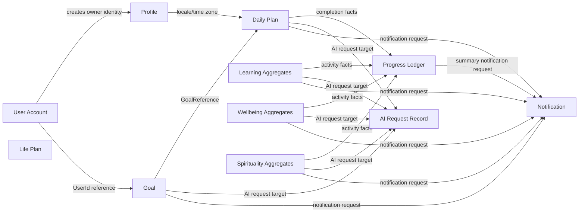

# LifePilot AI - Domain Model - Aggregates

**Status:** Milestone 0.3 draft for approval.  
**Source:** Product decisions, ADRs, Event Storming, Domain Decomposition, Ubiquitous Language, and Bounded Contexts.  
**Rule:** Aggregates marked `Pending approval` are architectural placeholders for approved ownership only. They must not be implemented until their missing product rules are approved.

## Aggregate Design Principles

- One aggregate belongs to exactly one bounded context.
- Aggregate roots are the only objects allowed to enforce consistency for their child entities.
- Cross-context references use stable identifiers, read contracts, or events only.
- AI output is never an aggregate state change until the target aggregate validates and accepts it through a deterministic command.
- Dashboard projections, logs, jobs, and external provider records are not business aggregates unless explicitly listed here.

## Aggregate Relationship Diagram

## Identity & Access

### User Account

| Dimension | Design |
|---|---|
| Aggregate Root | User Account |
| Purpose | Represent an authenticated individual account and account lifecycle. |
| Responsibilities | Registration identity, email verification state, account status, account deletion/disable/restore commands, account-level security events. |
| Consistency Boundary | Email identity, account status, verification status, and account lifecycle state. Refresh token sessions and role assignments remain separate aggregates to avoid overloading the account boundary. |
| Invariants | Email must be unique under approved normalization; disabled/deleted accounts cannot authenticate; credentials and token values are never plain text; account lifecycle changes are audited. |
| Commands | Register Account, Sign In with Google, Verify Email, Request Password Reset, Complete Password Reset, Disable Account, Restore Account, Request Account Deletion, Execute Approved Deletion. |
| Domain Events | UserRegistered, GoogleAccountLinked, EmailVerificationRequested, EmailVerified, PasswordResetRequested, PasswordResetCompleted, AccountDisabled, AccountRestored, AccountDeleted. |
| Child Entities | Email Credential, Verification Token, Password Reset Token, Google Login Link. |
| Value Objects | UserId, EmailAddress, PasswordHash, TokenHash, AccountStatus, VerificationStatus. |
| State Machine | Unregistered -> RegisteredUnverified -> ActiveVerified -> Disabled -> RestoredActive; any non-deleted state -> Deleted after approved deletion policy. |
| Lifecycle | Created by registration or Google login; verified; used while active; disabled/restored by authorized admin; deleted only under approved retention policy. |
| Factory Rules | Create only from unique email/password registration or approved Google account link. |
| Validation Rules | Email format and uniqueness; password policy pending; Google claims normalized through ACL; deletion/export/minor-consent policy pending. |

### External Login Link

| Dimension | Design |
|---|---|
| Aggregate Root | External Login Link |
| Purpose | Own the lifecycle of a linked external identity provider account. |
| Responsibilities | Link Google identity in Version 1; prepare for Microsoft and Apple in the future without changing User Account rules. |
| Consistency Boundary | One external provider subject linked to one UserId. |
| Invariants | Provider subject cannot be linked to multiple active users; provider claims enter through an anti-corruption layer; external login is not a role or subscription. |
| Commands | Link External Login, Unlink External Login where approved. |
| Domain Events | GoogleAccountLinked, ExternalLoginUnlinked where approved. |
| Child Entities | None approved. |
| Value Objects | ExternalLoginId, ProviderCode, ProviderSubject, UserId. |
| State Machine | Linked -> Unlinked where approved. |
| Lifecycle | Created when external provider identity is accepted; unlinking policy pending. |
| Factory Rules | Requires normalized provider identity from External Identity ACL. |
| Validation Rules | Microsoft, Apple, and unlinking behavior are future/pending. |

### Refresh Token Session

| Dimension | Design |
|---|---|
| Aggregate Root | Refresh Token Session |
| Purpose | Own durable refresh-token lifecycle separate from account profile state. |
| Responsibilities | Issue, rotate, revoke, expire, and audit refresh-token sessions. |
| Consistency Boundary | One session token chain and its rotation/revocation state. |
| Invariants | Only hashed tokens are stored; a revoked or expired token cannot be rotated; rotation invalidates the previous token in the chain. |
| Commands | Issue Refresh Token, Rotate Refresh Token, Revoke Refresh Token, Expire Refresh Token. |
| Domain Events | RefreshTokenIssued, RefreshTokenRotated, RefreshTokenRevoked, RefreshTokenExpired. |
| Child Entities | Refresh Token. |
| Value Objects | TokenHash, TokenExpiry, SessionId, UserId. |
| State Machine | Issued -> Rotated or Revoked or Expired. |
| Lifecycle | Created after successful authentication; rotated during refresh; revoked on logout/security action; expired by cleanup job. |
| Factory Rules | Must be created for an active authenticated UserId only. |
| Validation Rules | Token expiry must be UTC; token reuse policy and device metadata are pending. |

### Role Assignment

| Dimension | Design |
|---|---|
| Aggregate Root | Role Assignment |
| Purpose | Own assignment and revocation of approved roles. |
| Responsibilities | Grant/revoke User, Admin, and Super Admin roles under audited authorization. |
| Consistency Boundary | One user's role assignment set. |
| Invariants | Only approved roles may be assigned; role changes require authorization and audit; roles are not subscription entitlements. |
| Commands | Assign Role, Revoke Role. |
| Domain Events | RoleAssigned, RoleRevoked. |
| Child Entities | Role Assignment Record. |
| Value Objects | RoleName, PermissionCode, UserId. |
| State Machine | Unassigned -> Assigned -> Revoked. |
| Lifecycle | Created by authorized administrative action; changed through explicit commands only. |
| Factory Rules | Default `User` role may be assigned during account registration. Admin/Super Admin assignment requires approved authority. |
| Validation Rules | Cannot assign unknown role; cannot use role to model Premium. |

## Profile & Personalization

### Profile

| Dimension | Design |
|---|---|
| Aggregate Root | Profile |
| Purpose | Own personalization and localization information for a user. |
| Responsibilities | Display identity, locale, text direction, time zone, preference links, profile completeness. |
| Consistency Boundary | Profile fields and profile completeness state. |
| Invariants | One Profile per UserId; Profile cannot store credentials, roles, refresh tokens, body measurements, goals, plans, or progress facts; text direction is derived from locale. |
| Commands | Create Profile, Complete Profile, Update Profile, Update Locale, Update Time Zone, Update Preferences. |
| Domain Events | ProfileCreated, ProfileCompleted, ProfileUpdated, UserLocaleChanged, UserTimeZoneChanged, UserPreferencesUpdated. |
| Child Entities | Profile Completion State, Preference Entry. |
| Value Objects | DisplayName, Locale, TextDirection, TimeZoneId, PreferenceKey, PreferenceValue. |
| State Machine | Created -> Incomplete -> Complete -> Updated; Deleted follows account deletion policy. |
| Lifecycle | Created from account registration event; completed by owner; updated by owner; deleted with account policy. |
| Factory Rules | Created only for an existing UserId from Identity & Access. |
| Validation Rules | Locale is Arabic or English in Version 1; time-zone standard is pending; profile media is pending approval. |

### User Preferences

| Dimension | Design |
|---|---|
| Aggregate Root | User Preferences |
| Purpose | Own user-level personalization preferences when they require independent consistency. |
| Responsibilities | Store approved preference keys and values that affect product behavior, localization, or experience. |
| Consistency Boundary | One user's approved preference set. |
| Invariants | Preferences cannot store credentials, roles, body measurements, progress facts, or source-domain state; notification preferences may move to Communications if approved. |
| Commands | Update Preferences, Remove Preference where approved. |
| Domain Events | UserPreferencesUpdated. |
| Child Entities | Preference Entry. |
| Value Objects | PreferenceKey, PreferenceValue, Locale where relevant, TimeZoneId where relevant. |
| State Machine | Default -> Customized -> Updated. |
| Lifecycle | Created with Profile defaults; updated by owner; deleted with account policy. |
| Factory Rules | Created only for an existing Profile/UserId. |
| Validation Rules | Approved preference catalog pending. |

### Consent Record

| Dimension | Design |
|---|---|
| Aggregate Root | Consent Record |
| Purpose | Track privacy or processing consent when approved. |
| Responsibilities | Record, withdraw, and expose approved consent state. |
| Consistency Boundary | One consent purpose for one user. |
| Invariants | Consent must be traceable to purpose, actor, timestamp, and policy version. |
| Commands | Record Consent, Withdraw Consent. |
| Domain Events | ConsentRecorded, ConsentWithdrawn. |
| Child Entities | None approved. |
| Value Objects | ConsentPurpose, ConsentStatus, PolicyVersion, UserId, UTC Instant. |
| State Machine | NotRecorded -> Granted -> Withdrawn. |
| Lifecycle | Pending legal/product approval. |
| Factory Rules | Cannot be created without approved purpose taxonomy. |
| Validation Rules | Retention, minors, export, and deletion rules are pending. |

## Personal Direction

### Goal

| Dimension | Design |
|---|---|
| Aggregate Root | Goal |
| Purpose | Represent a user-owned desired outcome. |
| Responsibilities | Goal lifecycle, milestone ownership, goal progress facts, AI proposal acceptance/rejection. |
| Consistency Boundary | Goal root, milestones, and goal-owned progress records. |
| Invariants | Goal belongs to one user; Planner may reference but not mutate; Progress may derive but not mutate; AI cannot complete or update a goal directly. |
| Commands | Create Goal, Update Goal, Add Milestone, Update Milestone, Record Goal Progress, Pause Goal, Resume Goal, Complete Goal, Archive Goal, Apply Proposed Goal Change, Reject Proposed Goal Change. |
| Domain Events | GoalCreated, GoalUpdated, GoalMilestoneAdded, GoalMilestoneUpdated, GoalProgressRecorded, GoalPaused, GoalResumed, GoalCompleted, GoalArchived, GoalChangeProposalApplied, GoalChangeProposalRejected. |
| Child Entities | Goal Milestone, Goal Progress Record. |
| Value Objects | GoalId, GoalTitle, GoalDescription, GoalStatus, MilestoneId, GoalReference, GoalDueDate where approved. |
| State Machine | Draft/Active/Paused/Completed/Archived is proposed and requires approval. |
| Lifecycle | Created; optionally updated and progressed; paused/resumed where approved; completed or archived. |
| Factory Rules | Must be created by owner; title and purpose validation pending detailed functional rules. |
| Validation Rules | Archived/completed goals cannot accept progress unless reopen policy is approved; due dates/reminders/recurrence pending. |

## Personal Planning

### Life Plan

| Dimension | Design |
|---|---|
| Aggregate Root | Life Plan |
| Purpose | Own broad planning containers for a user's personal planning area. |
| Responsibilities | Organize planning scope without owning source-domain activities. |
| Consistency Boundary | Life plan metadata and associated daily plan references. |
| Invariants | Life Plan belongs to one user; does not own goals, workouts, meals, learning sessions, or spiritual progress. |
| Commands | Create Plan, Update Plan, Archive Plan where approved. |
| Domain Events | LifePlanCreated, LifePlanUpdated, LifePlanArchived where approved. |
| Child Entities | Daily Plan reference list where approved. |
| Value Objects | LifePlanId, PlanTitle, UserId. |
| State Machine | Created -> Active -> Archived, pending approval. |
| Lifecycle | Minimal Version 1 role; detailed behavior pending. |
| Factory Rules | Created by owner only. |
| Validation Rules | Must not become a generic super-aggregate over all life data. |

### Daily Plan

| Dimension | Design |
|---|---|
| Aggregate Root | Daily Plan |
| Purpose | Own the user's plan for one user-visible day. |
| Responsibilities | Plan item creation, ordering, update, removal, completion, skip, and accepted AI plan proposals. |
| Consistency Boundary | One daily plan and its ordered plan items. |
| Invariants | Belongs to one user and one plan date; plan item order is unique within the plan; plan items reference goals/specialized plans by reference only; AI cannot schedule or complete items. |
| Commands | Create Daily Plan, Add Plan Item, Update Plan Item, Reorder Plan Item, Mark Plan Item Complete, Skip Plan Item, Remove Plan Item, Apply Plan Proposal, Reject Plan Proposal. |
| Domain Events | DailyPlanCreated, PlanItemAdded, PlanItemUpdated, PlanItemReordered, PlanItemCompleted, PlanItemSkipped, PlanItemRemoved, PlanProposalApplied, PlanProposalRejected. |
| Child Entities | Plan Item. |
| Value Objects | DailyPlanId, PlanDate, PlanItemId, PlanItemStatus, PlanItemOrder, GoalReference, TargetAggregateReference, TimeWindow where approved. |
| State Machine | Draft/Open -> Amended -> Closed is proposed; item states are Planned -> Completed/Skipped/Removed. |
| Lifecycle | Created for a date; changed through owner commands; day close/rollover pending approval. |
| Factory Rules | Created by owner; duplicate daily-plan-per-date policy pending. |
| Validation Rules | Scheduling, recurrence, priorities, time blocks, conflicts, rollover, and reminders are pending. |

## Learning

### Study Workspace

| Dimension | Design |
|---|---|
| Aggregate Root | Study Workspace |
| Purpose | Own a user's study area and material collection. |
| Responsibilities | Workspace creation, material association, access policy, material lifecycle coordination. |
| Consistency Boundary | Workspace metadata and material references. |
| Invariants | Workspace belongs to one user; sharing is not approved; material content is not published in events. |
| Commands | Create Study Workspace, Add Material Reference, Remove Material Reference. |
| Domain Events | StudyWorkspaceCreated, StudyMaterialUploadRequested, StudyMaterialUploaded, StudyMaterialRemoved. |
| Child Entities | Study Material reference entries. |
| Value Objects | StudyWorkspaceId, StudyMaterialId, Subject, MaterialStorageReference. |
| State Machine | Created -> Active -> Archived is proposed. |
| Lifecycle | Created by owner; materials added/removed; archive pending. |
| Factory Rules | Owner creates workspace; default workspace behavior pending. |
| Validation Rules | Upload file types, size, scanning, OCR, retention, and deletion are pending. |

### Study Material

| Dimension | Design |
|---|---|
| Aggregate Root | Study Material |
| Purpose | Own metadata and processing state for uploaded study material. |
| Responsibilities | Upload acceptance/rejection, processing state, extracted-content readiness metadata, AI request eligibility. |
| Consistency Boundary | One material's metadata and processing state. |
| Invariants | Material belongs to one workspace/user; blob reference is not domain ownership; raw content is not in events/logs; AI only uses minimum necessary content. |
| Commands | Upload Study Material, Reject Study Material, Request Material Processing, Mark Material Processed, Record Processing Failure, Remove Study Material. |
| Domain Events | StudyMaterialUploaded, StudyMaterialRejected, StudyMaterialProcessingRequested, StudyMaterialProcessed, StudyMaterialProcessingFailed. |
| Child Entities | Study Material Processing Record. |
| Value Objects | StudyMaterialId, MaterialStorageReference, MaterialProcessingStatus, FileMetadata where approved. |
| State Machine | Uploaded -> Processing -> Processed or Failed -> Removed. |
| Lifecycle | Created by upload; processed asynchronously; used for AI assistance; removed under retention policy. |
| Factory Rules | Cannot be created without approved storage reference and owner. |
| Validation Rules | Upload constraints and OCR provider not approved. |

### Study Session

| Dimension | Design |
|---|---|
| Aggregate Root | Study Session |
| Purpose | Record user-owned study activity. |
| Responsibilities | Start, complete, cancel, and publish completion fact. |
| Consistency Boundary | One study session's state. |
| Invariants | Completion is user/deterministic, not AI inferred; session belongs to one user/workspace. |
| Commands | Create Study Session, Start Study Session, Complete Study Session, Cancel Study Session. |
| Domain Events | StudySessionStarted, StudySessionCompleted, StudySessionCancelled where approved. |
| Child Entities | None approved. |
| Value Objects | StudySessionId, StudyWorkspaceId, Subject, SessionStatus, UTC Instant. |
| State Machine | Planned where approved -> Started -> Completed or Cancelled. |
| Lifecycle | Session started and completed/cancelled by owner. |
| Factory Rules | Requires owner and optional workspace/material reference. |
| Validation Rules | Duration and completion rules pending. |

### External Course

| Dimension | Design |
|---|---|
| Aggregate Root | External Course |
| Purpose | Represent a user-tracked external learning offering. |
| Responsibilities | Course metadata, archive/update, user-owned course reference. |
| Consistency Boundary | One user-created course reference. |
| Invariants | Platform does not claim provider partnership, certificate validity, or automatic provider sync. |
| Commands | Add External Course, Update External Course, Archive Course. |
| Domain Events | ExternalCourseAdded, ExternalCourseUpdated, CourseArchived. |
| Child Entities | None approved. |
| Value Objects | CourseReference, CourseTitle, CourseUrl where approved. |
| State Machine | Added -> Active -> Archived. |
| Lifecycle | Added by user; updated; archived. |
| Factory Rules | Must belong to owner; URL validation limited until provider rules approved. |
| Validation Rules | Scraping, OAuth, provider sync, and certificates are not approved. |

### Course Enrollment

| Dimension | Design |
|---|---|
| Aggregate Root | Course Enrollment |
| Purpose | Own a user's relationship and progress against an External Course. |
| Responsibilities | Enrollment, progress record, completion, archive. |
| Consistency Boundary | One user's enrollment state for one course reference. |
| Invariants | Progress is user-declared unless approved import exists; AI cannot assert completion. |
| Commands | Enroll in Course, Update Course Progress, Complete Course, Archive Enrollment. |
| Domain Events | CourseEnrollmentCreated, CourseProgressRecorded, CourseCompleted, CourseArchived. |
| Child Entities | Course Progress Record. |
| Value Objects | CourseEnrollmentId, CourseReference, CourseProgressValue where approved, CompletionStatus. |
| State Machine | Enrolled -> InProgress -> Completed or Archived. |
| Lifecycle | Created by enrollment; progressed by owner; completed/archived. |
| Factory Rules | Requires course reference and owner. |
| Validation Rules | Progress scale/percentage rules pending. |

### Language Learning Profile

| Dimension | Design |
|---|---|
| Aggregate Root | Language Learning Profile |
| Purpose | Own language-learning configuration for a user. |
| Responsibilities | Target language references and learner settings where approved. |
| Consistency Boundary | One user's language learning setup. |
| Invariants | Cannot assign authoritative proficiency without approved assessment rules. |
| Commands | Configure Learning Profile, Update Learning Profile. |
| Domain Events | LanguageLearningProfileConfigured, LanguageLearningProfileUpdated. |
| Child Entities | None approved. |
| Value Objects | LanguageCode, LearningLevel where approved. |
| State Machine | NotConfigured -> Configured -> Updated. |
| Lifecycle | Created by owner; updated by owner. |
| Factory Rules | Requires approved language code. |
| Validation Rules | Assessment/provider rules pending. |

### Learning Plan

| Dimension | Design |
|---|---|
| Aggregate Root | Learning Plan |
| Purpose | Own language/study plan content, not daily scheduling. |
| Responsibilities | Plan content state and accepted AI learning proposals. |
| Consistency Boundary | One learning plan's content and state. |
| Invariants | Does not own Daily Plan scheduling; AI proposals require deterministic validation. |
| Commands | Create Learning Plan, Update Learning Plan, Apply Learning Plan Proposal. |
| Domain Events | LearningPlanCreated, LearningPlanUpdated, LearningPlanProposalApplied. |
| Child Entities | Learning Plan Item where approved. |
| Value Objects | LearningPlanId, LanguageCode, Subject, TargetAggregateReference. |
| State Machine | Created -> Active -> Retired is proposed. |
| Lifecycle | Pending detailed curriculum requirements. |
| Factory Rules | Created by owner for approved learning purpose. |
| Validation Rules | Curriculum, lessons, chapters, and spaced repetition are pending. |

### Learning Session

| Dimension | Design |
|---|---|
| Aggregate Root | Learning Session |
| Purpose | Record language-learning activity. |
| Responsibilities | Start, complete, cancel, and publish language session facts. |
| Consistency Boundary | One learning session's state. |
| Invariants | AI cannot complete sessions or assign proficiency. |
| Commands | Start Learning Session, Complete Learning Session, Cancel Learning Session. |
| Domain Events | LearningSessionStarted, LearningSessionCompleted, LearningSessionCancelled where approved. |
| Child Entities | Vocabulary Progress Record where approved. |
| Value Objects | LearningSessionId, LanguageCode, SessionStatus. |
| State Machine | Started -> Completed or Cancelled. |
| Lifecycle | Created by owner; completed/cancelled. |
| Factory Rules | Requires owner and language context. |
| Validation Rules | Duration/proficiency rules pending. |

## Wellbeing

### Wellbeing Profile

| Dimension | Design |
|---|---|
| Aggregate Root | Wellbeing Profile |
| Purpose | Own sensitive wellbeing baseline and measurement references. |
| Responsibilities | Body measurement ownership and wellbeing-level configuration. |
| Consistency Boundary | User wellbeing profile and measurement references. |
| Invariants | Body measurements are not stored in Profile, Nutrition, or Gym separately; sensitive data is owner-private. |
| Commands | Create Wellbeing Profile, Update Wellbeing Profile, Record Body Measurement, Correct Body Measurement. |
| Domain Events | WellbeingProfileUpdated, BodyMeasurementRecorded, BodyMeasurementCorrected. |
| Child Entities | Body Measurement Record. |
| Value Objects | Weight, Height, MeasurementUnit, MeasurementInstant. |
| State Machine | Created -> Updated; measurement records are Recorded -> Corrected/Superseded. |
| Lifecycle | Created when user begins wellbeing features; updated/corrected by owner. |
| Factory Rules | Requires owner; unit strategy pending. |
| Validation Rules | BMI/calculation/health disclaimer rules pending. |

### Body Measurement Record

| Dimension | Design |
|---|---|
| Aggregate Root | Body Measurement Record |
| Purpose | Own a single sensitive body measurement fact when independent correction/audit is required. |
| Responsibilities | Record immutable measurement value, correction/supersession metadata, and publication of minimized measurement facts. |
| Consistency Boundary | One measurement record and its correction status. |
| Invariants | Belongs to one user; Wellbeing is sole owner; Profile, Nutrition, and Fitness may reference but not copy ownership; BMI is not created unless approved. |
| Commands | Record Body Measurement, Correct Body Measurement, Supersede Body Measurement. |
| Domain Events | BodyMeasurementRecorded, BodyMeasurementCorrected. |
| Child Entities | None approved. |
| Value Objects | Weight, Height, MeasurementUnit, MeasurementInstant, BodyMeasurementKind. |
| State Machine | Recorded -> Corrected or Superseded. |
| Lifecycle | Recorded by owner; corrected/superseded instead of overwritten. |
| Factory Rules | Requires owner, measurement kind, approved unit, and UTC measurement instant. |
| Validation Rules | Unit catalog, history retention, BMI, and health disclaimers pending. |

### Nutrition Profile

| Dimension | Design |
|---|---|
| Aggregate Root | Nutrition Profile |
| Purpose | Own nutrition-specific settings without owning medical diagnosis. |
| Responsibilities | User nutrition setup and safety disclaimer acknowledgment where approved. |
| Consistency Boundary | Nutrition profile fields only. |
| Invariants | Does not own body measurements; no medical treatment claims. |
| Commands | Create Nutrition Profile, Update Nutrition Profile. |
| Domain Events | NutritionProfileCreated, NutritionProfileUpdated. |
| Child Entities | None approved. |
| Value Objects | NutritionProfileId, WellbeingProfileReference. |
| State Machine | NotCreated -> Created -> Updated. |
| Lifecycle | Created/updated by owner. |
| Factory Rules | Requires WellbeingProfileReference. |
| Validation Rules | Allergies, food source, medical exclusions, and age restrictions pending. |

### Meal Record

| Dimension | Design |
|---|---|
| Aggregate Root | Meal Record |
| Purpose | Record a user nutrition occurrence. |
| Responsibilities | Meal record creation, correction, removal, and publication of nutrition activity facts. |
| Consistency Boundary | One meal record and its approved meal entries. |
| Invariants | Nutrition calculations are deterministic and only when approved; AI cannot calculate authoritative values. |
| Commands | Record Meal, Update Meal Record, Remove Meal Record. |
| Domain Events | MealRecorded, MealRecordUpdated, MealRecordRemoved. |
| Child Entities | Meal Entry. |
| Value Objects | MealId, MealTime, NutritionMeasurement where approved. |
| State Machine | Recorded -> Corrected or Removed. |
| Lifecycle | Recorded by owner; corrected/removed under audit policy. |
| Factory Rules | Requires owner and meal occurrence time. |
| Validation Rules | Recipe, ingredient, calories, macros, and food database rules pending. |

### Meal Plan

| Dimension | Design |
|---|---|
| Aggregate Root | Meal Plan |
| Purpose | Own nutrition plan content. |
| Responsibilities | Create/update nutrition plan content and accept/reject AI nutrition plan proposals. |
| Consistency Boundary | One meal plan's content and state. |
| Invariants | Not a medical prescription; does not own daily scheduling; proposals must be validated. |
| Commands | Create Nutrition Plan, Update Nutrition Plan, Apply Nutrition Plan Proposal, Reject Nutrition Plan Proposal. |
| Domain Events | NutritionPlanCreated, NutritionPlanUpdated, NutritionPlanProposalApplied, NutritionPlanProposalRejected. |
| Child Entities | Meal Plan Item where approved. |
| Value Objects | MealPlanId, NutritionPlanStatus. |
| State Machine | Created -> Active -> Retired is proposed. |
| Lifecycle | Pending detailed nutrition rules. |
| Factory Rules | Requires owner and non-medical purpose. |
| Validation Rules | Targets, calories, macros, allergy rules pending. |

### Fitness Profile

| Dimension | Design |
|---|---|
| Aggregate Root | Fitness Profile |
| Purpose | Own fitness-specific settings. |
| Responsibilities | Fitness profile setup and user-specific fitness context where approved. |
| Consistency Boundary | Fitness profile state only. |
| Invariants | Does not own body measurements; no medical diagnosis. |
| Commands | Create Fitness Profile, Update Fitness Profile. |
| Domain Events | FitnessProfileCreated, FitnessProfileUpdated. |
| Child Entities | None approved. |
| Value Objects | FitnessProfileId, WellbeingProfileReference. |
| State Machine | NotCreated -> Created -> Updated. |
| Lifecycle | Created/updated by owner. |
| Factory Rules | Requires owner and WellbeingProfileReference. |
| Validation Rules | Equipment, injury, age, and safety rules pending. |

### Workout Program

| Dimension | Design |
|---|---|
| Aggregate Root | Workout Program |
| Purpose | Own fitness plan content. |
| Responsibilities | Workout content structure and accepted AI workout proposals. |
| Consistency Boundary | One workout program and its exercise plan entries. |
| Invariants | Does not own daily scheduling; AI cannot prescribe medical treatment or directly alter plan. |
| Commands | Create Workout Plan, Update Workout Plan, Apply Workout Plan Proposal, Reject Workout Plan Proposal. |
| Domain Events | WorkoutPlanCreated, WorkoutPlanUpdated, WorkoutPlanProposalApplied, WorkoutPlanProposalRejected. |
| Child Entities | Planned Exercise where approved. |
| Value Objects | WorkoutProgramId, ExerciseReference, MuscleGroup. |
| State Machine | Created -> Active -> Retired is proposed. |
| Lifecycle | Created/updated/retired by owner. |
| Factory Rules | Requires approved exercise references where catalog is approved. |
| Validation Rules | Exercise catalog and plan calculations pending. |

### Workout Session

| Dimension | Design |
|---|---|
| Aggregate Root | Workout Session |
| Purpose | Record execution of workout activity. |
| Responsibilities | Start session, record exercises, complete session, publish workout facts. |
| Consistency Boundary | One workout session and its exercise records. |
| Invariants | Completion is owner/deterministic; AI cannot infer completion; session belongs to one user. |
| Commands | Start Workout Session, Record Exercise, Complete Workout Session, Cancel Workout Session. |
| Domain Events | WorkoutSessionStarted, ExerciseRecorded, WorkoutSessionCompleted, WorkoutSessionCancelled where approved. |
| Child Entities | Exercise Record. |
| Value Objects | WorkoutSessionId, ExerciseReference, MuscleGroup, SessionStatus. |
| State Machine | Started -> Completed or Cancelled. |
| Lifecycle | Started; exercises recorded; completed/cancelled. |
| Factory Rules | Requires owner and optional WorkoutProgramReference. |
| Validation Rules | Exercise metrics and safety rules pending. |

## Spirituality

### Spiritual Profile

| Dimension | Design |
|---|---|
| Aggregate Root | Spiritual Profile |
| Purpose | Own spiritual preferences. |
| Responsibilities | Configure spiritual preferences and approved Islamic-assistance settings. |
| Consistency Boundary | One user's spiritual preferences. |
| Invariants | Spiritual preferences are private; global locale/time zone remains Profile-owned. |
| Commands | Configure Spiritual Preferences, Update Spiritual Preferences. |
| Domain Events | SpiritualProfileConfigured, SpiritualProfileUpdated. |
| Child Entities | None approved. |
| Value Objects | SpiritualPreference, PrayerConvention where approved. |
| State Machine | NotConfigured -> Configured -> Updated. |
| Lifecycle | Created/updated by owner. |
| Factory Rules | Requires owner. |
| Validation Rules | Prayer-time method, location consent, and convention rules pending. |

### Prayer Progress Record

| Dimension | Design |
|---|---|
| Aggregate Root | Prayer Progress Record |
| Purpose | Record self-reported private prayer progress. |
| Responsibilities | Record/update prayer progress and publish spiritual activity facts. |
| Consistency Boundary | One prayer progress record. |
| Invariants | Self-reported only; AI cannot verify observance; no prayer-time calculations without approved deterministic source. |
| Commands | Record Prayer Progress, Update Prayer Progress. |
| Domain Events | PrayerProgressRecorded, PrayerProgressUpdated. |
| Child Entities | Prayer Progress Entry. |
| Value Objects | PrayerReference, PrayerProgressStatus where approved, UTC Instant. |
| State Machine | Recorded -> Updated/Corrected. |
| Lifecycle | Recorded by owner; corrected by owner under policy. |
| Factory Rules | Requires owner and prayer reference. |
| Validation Rules | Expected/recorded status model pending. |

### Spiritual Plan

| Dimension | Design |
|---|---|
| Aggregate Root | Spiritual Plan |
| Purpose | Own spiritual plan content. |
| Responsibilities | Create/update spiritual plan content and accept/reject AI spiritual plan proposals. |
| Consistency Boundary | One spiritual plan. |
| Invariants | Does not own daily scheduling; AI cannot issue binding religious ruling or mutate directly. |
| Commands | Create Spiritual Plan, Apply Spiritual Plan Proposal, Reject Spiritual Plan Proposal. |
| Domain Events | SpiritualPlanCreated, SpiritualPlanModificationProposed, SpiritualPlanProposalApplied, SpiritualPlanProposalRejected. |
| Child Entities | Spiritual Plan Item where approved. |
| Value Objects | SpiritualPlanId, SpiritualPlanStatus. |
| State Machine | Created -> Active -> Retired is proposed. |
| Lifecycle | Pending detailed spiritual plan requirements. |
| Factory Rules | Requires owner and approved purpose. |
| Validation Rules | Content-governance policy pending. |

## Progress & Insights

### Progress Ledger

| Dimension | Design |
|---|---|
| Aggregate Root | Progress Ledger |
| Purpose | Own deterministic cross-domain progress facts and summaries. |
| Responsibilities | Record source facts, derive summaries, reconcile projections, publish progress updates. |
| Consistency Boundary | One user's progress ledger entries and derived summaries for approved metrics. |
| Invariants | Source facts are immutable references; source contexts own corrections; AI cannot calculate or write progress; summaries are rebuildable. |
| Commands | Record Progress Fact, Rebuild Progress Projection, Reconcile Progress Projection. |
| Domain Events | ProgressFactRecorded, ProgressSummaryUpdated, ProgressProjectionRebuilt, ProgressDiscrepancyDetected, ProgressDiscrepancyResolved. |
| Child Entities | Progress Fact, Progress Summary, Reconciliation Record. |
| Value Objects | SourceEventId, MetricCode, MetricPeriod, ProgressPercentage, CompletionCount, FreshnessMarker. |
| State Machine | Empty -> Recording -> Summarized -> Reconciled; DiscrepancyDetected -> Resolved. |
| Lifecycle | Created on first source fact or onboarding; updated by facts; rebuilt/reconciled by authorized jobs. |
| Factory Rules | Requires owner and source event envelope. |
| Validation Rules | Metric definitions, rollup periods, correction semantics, scoring, and streaks pending. |

### Progress Metric Definition

| Dimension | Design |
|---|---|
| Aggregate Root | Progress Metric Definition |
| Purpose | Own approved deterministic metric definitions. |
| Responsibilities | Define metric code, eligible source events, rollup periods, and versioned calculation rules. |
| Consistency Boundary | One metric definition version. |
| Invariants | Metrics must be deterministic; AI cannot define or calculate authoritative metrics. |
| Commands | Create Metric Definition, Update Metric Definition, Retire Metric Definition. |
| Domain Events | ProgressMetricUpdated. |
| Child Entities | Metric Rule Entry where approved. |
| Value Objects | MetricCode, MetricVersion, MetricPeriod. |
| State Machine | Draft -> Active -> Retired is proposed. |
| Lifecycle | Pending metric product approval. |
| Factory Rules | Cannot be created without approved metric specification. |
| Validation Rules | Formula/rule catalog pending. |

## AI Assistance

### AI Request Record

| Dimension | Design |
|---|---|
| Aggregate Root | AI Request Record |
| Purpose | Own the lifecycle and governance metadata of an AI request. |
| Responsibilities | Authorize capability, record redaction, provider selection, provider attempt, response/failure, usage, and correlation. |
| Consistency Boundary | One AI request and provider attempts. |
| Invariants | Request must have authenticated user, approved capability, minimum necessary context, correlation ID, and provider-neutral outcome; raw prompts are not shared domain contracts. |
| Commands | Authorize AI Request, Reject AI Request, Record Redaction, Select Provider, Record AI Response, Record AI Failure, Record Quota Exceeded. |
| Domain Events | AIRequestAuthorized, AIRequestRejectedByPolicy, AIRequestRedacted, AIProviderSelected, AIResponseGenerated, AIResponseFailed, AIQuotaExceeded. |
| Child Entities | Provider Attempt, Redaction Record, Usage Record. |
| Value Objects | AICapability, ProviderCode, PromptClassification, RedactionOutcome, CorrelationId, TokenUsage. |
| State Machine | Submitted -> Authorized or Rejected -> Redacted -> ProviderSelected -> Generated or Failed. |
| Lifecycle | Created per AI request; completed/fails; retained under pending policy. |
| Factory Rules | Requires target context/capability and user authorization. |
| Validation Rules | Provider routing, quotas, cost, fallback, retention, and safety rules pending. |

### AI Proposal Record

| Dimension | Design |
|---|---|
| Aggregate Root | AI Proposal Record |
| Purpose | Own an AI-generated proposal before target-domain acceptance. |
| Responsibilities | Store proposal envelope metadata, target aggregate reference, acceptance/rejection outcome, and applied audit link. |
| Consistency Boundary | One proposal envelope. |
| Invariants | Proposal is not business state; target aggregate validates and applies; proposals expire only after approved policy. |
| Commands | Generate Proposal, Mark Proposal Applied, Mark Proposal Rejected. |
| Domain Events | AIProposalGenerated, AIProposalApplied, AIProposalRejected. |
| Child Entities | Applied Proposal Link. |
| Value Objects | TargetAggregateReference, ProposalStatus, CorrelationId. |
| State Machine | Generated -> Applied or Rejected or Expired where approved. |
| Lifecycle | Generated by AI request; accepted/rejected through target workflow. |
| Factory Rules | Must reference a target aggregate and capability. |
| Validation Rules | Confirmation model and proposal retention pending. |

### AI Usage Record

| Dimension | Design |
|---|---|
| Aggregate Root | AI Usage Record |
| Purpose | Own AI usage and quota-accounting facts when entitlement rules are approved. |
| Responsibilities | Record capability usage, provider-neutral usage metadata, quota period references, and reconciliation status. |
| Consistency Boundary | One user's usage facts for one approved quota period/capability. |
| Invariants | Usage cannot grant business permissions; quotas are not roles; cost/token metadata is operational and provider-neutral. |
| Commands | Record AI Usage, Reconcile AI Usage, Reset Quota Period where approved. |
| Domain Events | AIUsageRecorded, AIUsageReconciled, AIQuotaExceeded. |
| Child Entities | Usage Entry. |
| Value Objects | AICapability, UsagePeriod, TokenUsage, CostMetadata where approved. |
| State Machine | Open -> Reconciled -> Closed where approved. |
| Lifecycle | Pending quota and entitlement policy. |
| Factory Rules | Cannot enforce quotas until quota periods and entitlement rules are approved. |
| Validation Rules | Free/Premium limits, reset periods, and provider-cost policy pending. |

### Copilot Session

| Dimension | Design |
|---|---|
| Aggregate Root | Copilot Session |
| Purpose | Own user-facing AI Copilot conversation/session metadata if retention is approved. |
| Responsibilities | Session start, message/request grouping, deletion if policy allows. |
| Consistency Boundary | One user's Copilot session metadata. |
| Invariants | Retention is pending; session cannot own target-domain state. |
| Commands | Start Copilot Session, Delete Copilot Session. |
| Domain Events | CopilotSessionStarted, CopilotSessionDeleted. |
| Child Entities | Copilot Session Message Reference where approved. |
| Value Objects | CopilotSessionId, RetentionStatus. |
| State Machine | Started -> Closed/Deleted where approved. |
| Lifecycle | Pending retention/product policy. |
| Factory Rules | Requires authenticated user and AI feature access. |
| Validation Rules | Conversation retention and deletion policy pending. |

## Communications

### Notification

| Dimension | Design |
|---|---|
| Aggregate Root | Notification |
| Purpose | Own durable user-facing notification state. |
| Responsibilities | Create notification, record delivery attempts, mark delivered/read/failed/expired, queue email where approved. |
| Consistency Boundary | One notification and its delivery attempts. |
| Invariants | One recipient; safe template parameters only; SignalR is delivery, not notification state; source context owns business meaning. |
| Commands | Create Notification, Attempt Delivery, Mark Delivered, Mark Read, Mark Delivery Failed, Expire Notification. |
| Domain Events | NotificationCreated, InAppNotificationCreated, NotificationDelivered, NotificationRead, NotificationDeliveryFailed, EmailQueued, EmailSent, EmailFailed. |
| Child Entities | Notification Delivery Attempt, Email Dispatch Record, In-App Notification State. |
| Value Objects | NotificationId, TemplateKey, DeliveryChannel, DeliveryStatus, RecipientReference, SafeTemplateParameter, Urgency. |
| State Machine | Created -> Delivered -> Read; Created -> Failed -> Retried/Expired; EmailQueued -> Sent/Failed. |
| Lifecycle | Created from approved request; delivered via in-app/SignalR/email; read or expired. |
| Factory Rules | Created from approved event or notification request using safe template parameters. |
| Validation Rules | Consent, quiet hours, frequency, reminder timing, and email provider rules pending. |

### Notification Preference

| Dimension | Design |
|---|---|
| Aggregate Root | Notification Preference |
| Purpose | Own delivery preferences if separated from Profile. |
| Responsibilities | Channel preferences, opt-in/opt-out, reminder eligibility settings where approved. |
| Consistency Boundary | One user's communication preferences. |
| Invariants | Preferences cannot bypass legal consent or source-domain business meaning. |
| Commands | Update Notification Preferences. |
| Domain Events | NotificationPreferencesUpdated. |
| Child Entities | Channel Preference. |
| Value Objects | DeliveryChannel, PreferenceStatus, QuietHours where approved. |
| State Machine | Default -> Updated -> Withdrawn where approved. |
| Lifecycle | Pending consent/quiet-hours policy. |
| Factory Rules | Cannot be binding until notification preference ownership is approved. |
| Validation Rules | Consent and quiet-hours pending. |

## Aggregate Validation Report

| Check | Result | Resolution |
|---|---|---|
| No aggregate crosses bounded contexts | Pass | Cross-context references use identifiers/events only. |
| No dashboard aggregate as source truth | Pass | Dashboard remains Progress & Insights projection. |
| No generic Plan aggregate shared across contexts | Pass | Daily Plan, Learning Plan, Meal Plan, Workout Program, and Spiritual Plan have separate owners. |
| No duplicate body measurement ownership | Pass | Wellbeing Profile owns body measurements. |
| AI does not mutate business aggregates | Pass | Target aggregate commands validate and apply proposals. |
| TBD terms not implemented as aggregates | Pass with guardrail | TBD terms are excluded or marked pending approval. |
| Overlarge Learning and Wellbeing contexts | Acceptable risk | Retain for Version 1; future extraction candidates are documented. |

## DDD Redesign Decisions from Aggregate Review

| Candidate | Decision | Reason |
|---|---|---|
| Dashboard Preferences | Not an approved aggregate in Milestone 0.3 | Dashboard is a Progress & Insights projection; widget/layout rules are pending. |
| User Preferences | Kept as aggregate separate from Profile | Preferences may evolve independently and are consumed by multiple contexts; Profile still owns display/personalization identity. |
| Body Measurement Record | Kept as aggregate under Wellbeing | Sensitive correction/audit behavior may require independent consistency; Wellbeing remains sole owner. |
| External Login Link | Kept as aggregate under Identity & Access | Future Microsoft/Apple login can be added without changing User Account lifecycle. |
| AI Usage Record | Kept as aggregate, pending quota approval | Usage/quota may become independently consistent once Free/Premium rules are approved. |
| Notification Preference | Pending aggregate | Consent, quiet hours, and preference ownership need approval before implementation. |
| Generic Plan | Rejected | Would create shared mutable business data across Planning, Learning, Wellbeing, and Spirituality. |
| Generic Progress Percentage in source domains | Rejected | Progress & Insights owns derived metrics. |
