# LifePilot AI - Domain Model - State Machines

**Status:** Milestone 0.3 draft for approval.  
**Note:** States marked `proposed` require Product Owner approval before implementation.

## Aggregate State Diagrams

### Identity & Access

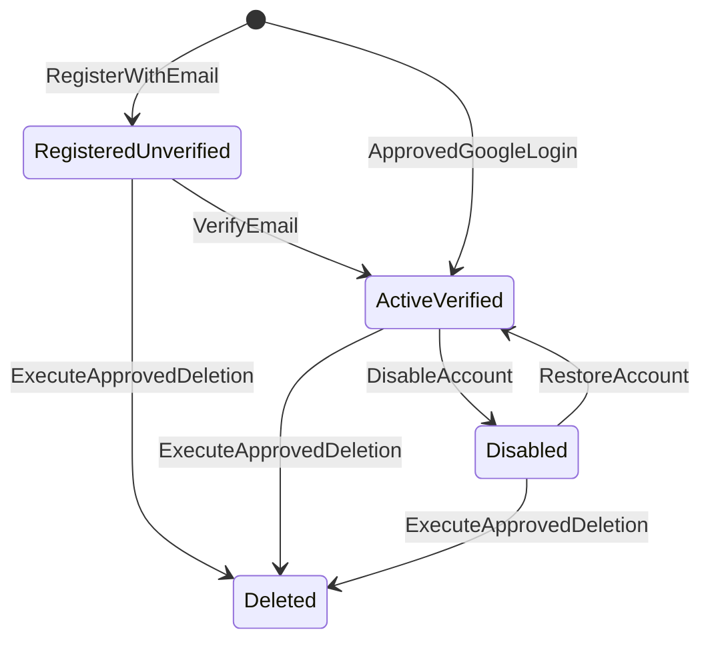

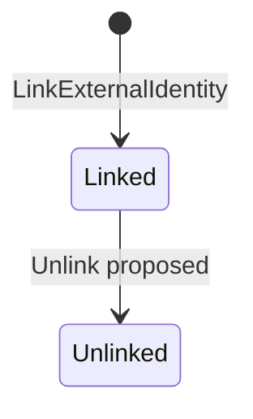

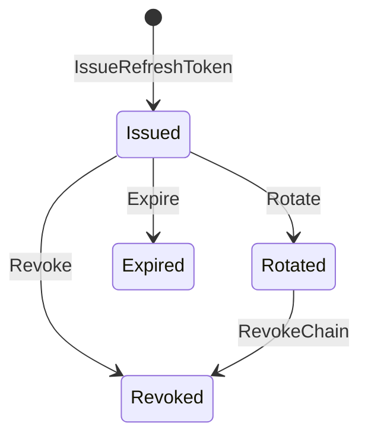

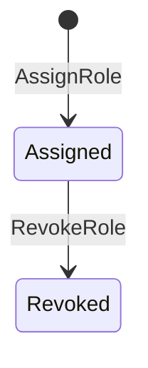

### Profile & Personalization

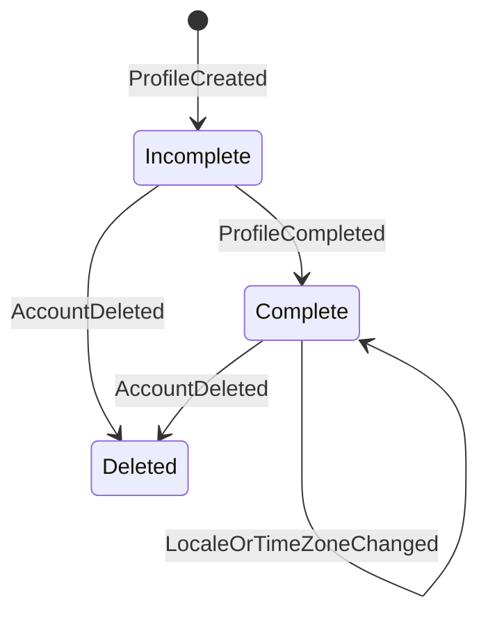

```mermaid
stateDiagram-v2
    [*] --> Default: CreateDefaultPreferences
    Default --> Customized: UpdatePreferences
    Customized --> Customized: UpdatePreferences
```

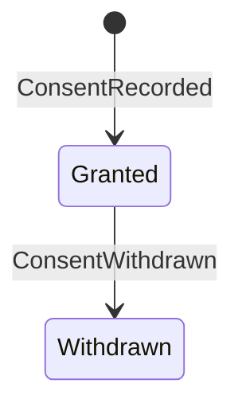

### Personal Direction

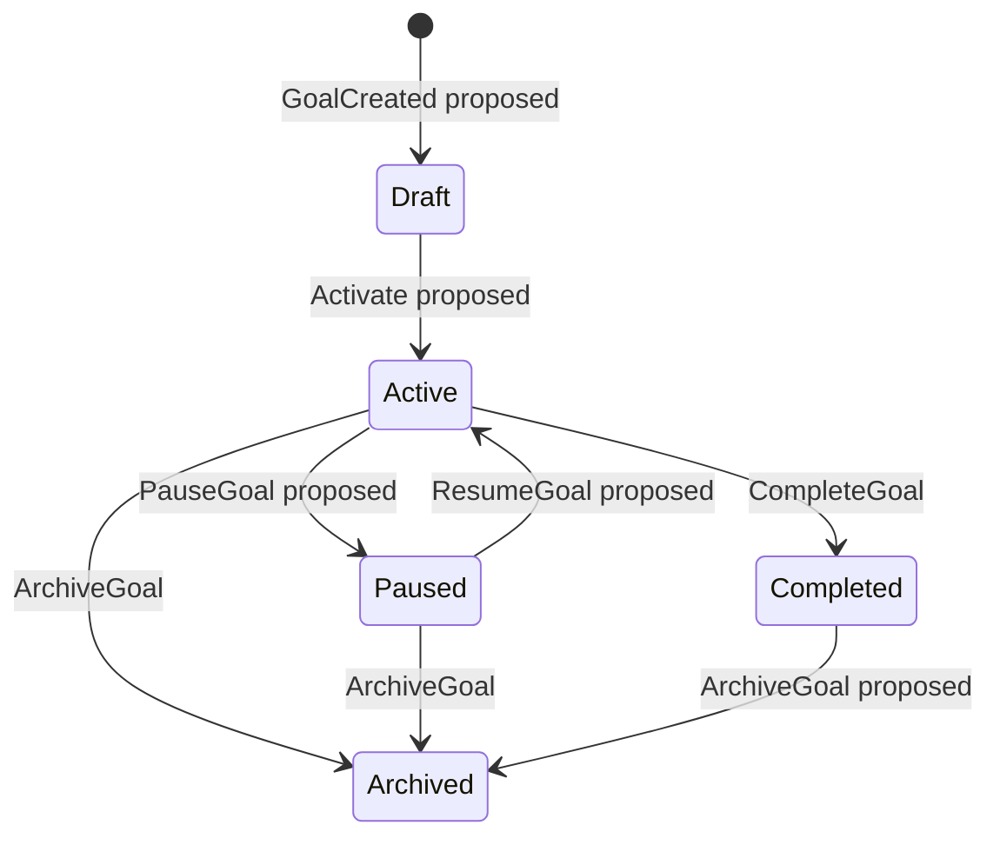

### Personal Planning

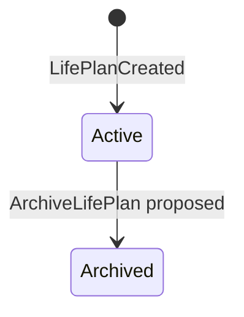

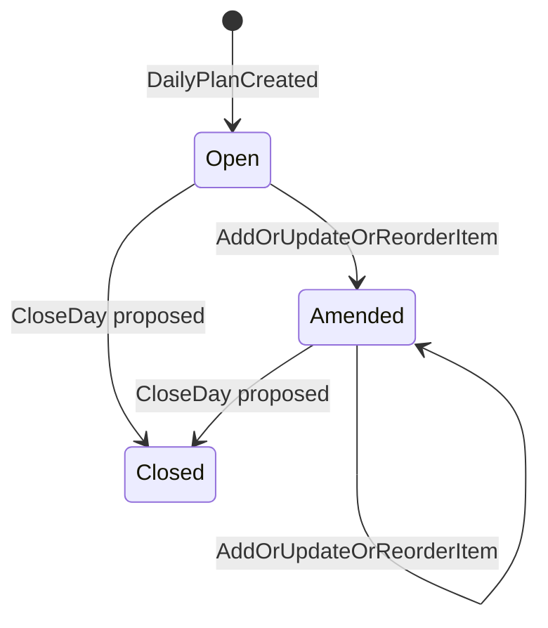

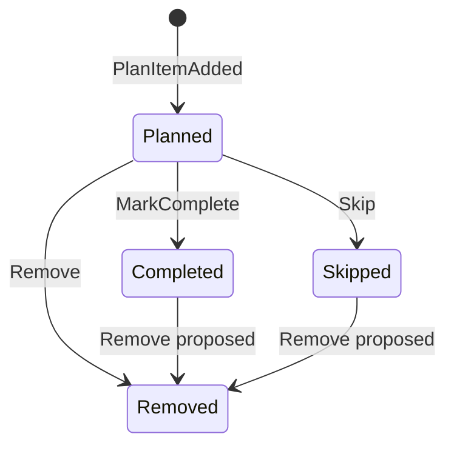

### Learning

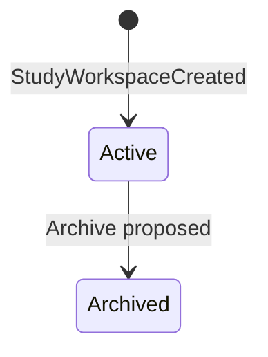

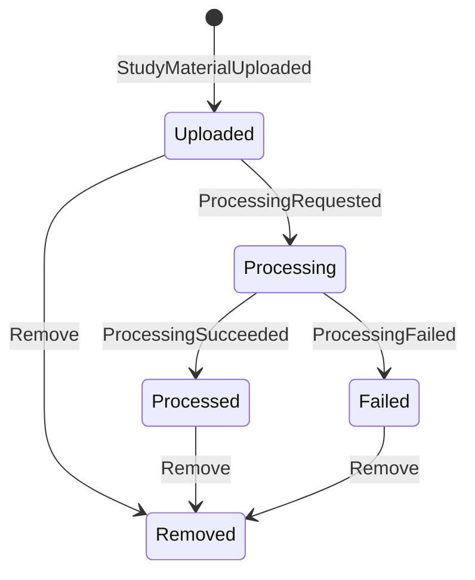

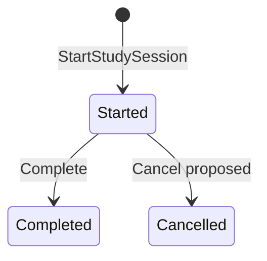

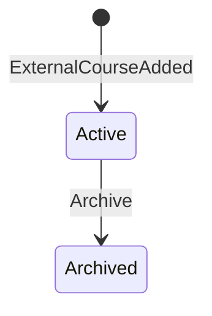

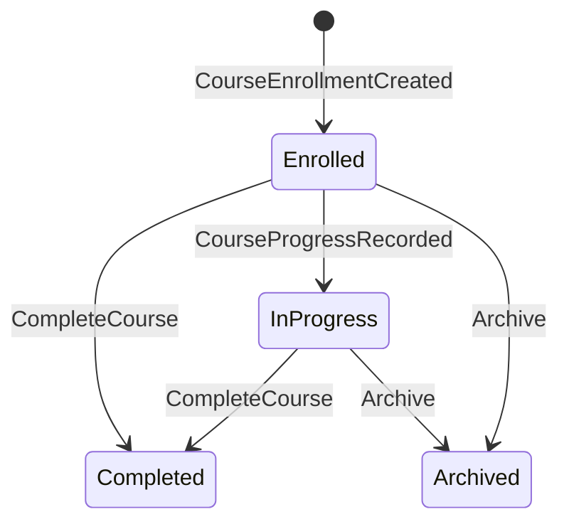

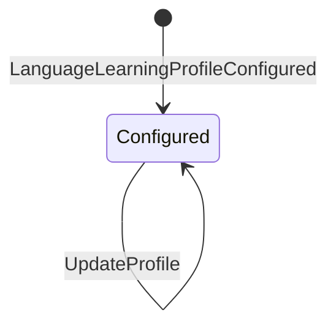

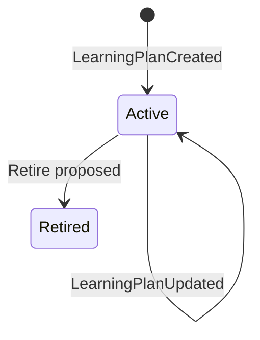

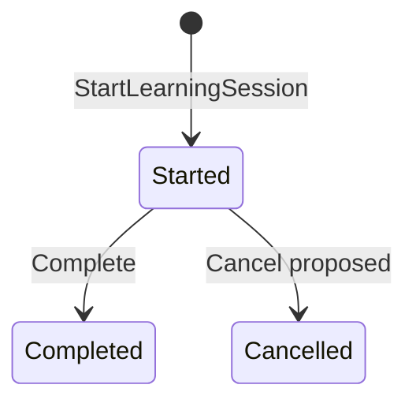

### Wellbeing

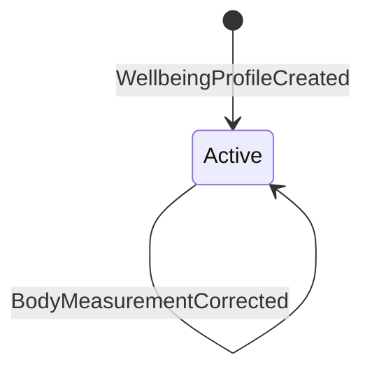

```mermaid
stateDiagram-v2
    [*] --> Recorded: RecordBodyMeasurement
    Recorded --> Corrected: CorrectBodyMeasurement
    Recorded --> Superseded: SupersedeBodyMeasurement
```

```mermaid
stateDiagram-v2
    [*] --> Created: NutritionProfileCreated
    Created --> Created: NutritionProfileUpdated
```

```mermaid
stateDiagram-v2
    [*] --> Recorded: MealRecorded
    Recorded --> Corrected: MealRecordUpdated
    Recorded --> Removed: MealRecordRemoved
    Corrected --> Removed: MealRecordRemoved
```

```mermaid
stateDiagram-v2
    [*] --> Active: NutritionPlanCreated
    Active --> Active: NutritionPlanUpdated
    Active --> Retired: Retire proposed
```

```mermaid
stateDiagram-v2
    [*] --> Created: FitnessProfileCreated
    Created --> Created: FitnessProfileUpdated
```

```mermaid
stateDiagram-v2
    [*] --> Active: WorkoutPlanCreated
    Active --> Active: WorkoutPlanUpdated
    Active --> Retired: Retire proposed
```

```mermaid
stateDiagram-v2
    [*] --> Started: WorkoutSessionStarted
    Started --> Started: ExerciseRecorded
    Started --> Completed: CompleteWorkoutSession
    Started --> Cancelled: Cancel proposed
```

### Spirituality

```mermaid
stateDiagram-v2
    [*] --> Configured: SpiritualProfileConfigured
    Configured --> Configured: UpdatePreferences
```

```mermaid
stateDiagram-v2
    [*] --> Recorded: PrayerProgressRecorded
    Recorded --> Corrected: PrayerProgressUpdated
```

```mermaid
stateDiagram-v2
    [*] --> Active: SpiritualPlanCreated
    Active --> Active: SpiritualPlanProposalApplied
    Active --> Retired: Retire proposed
```

### Progress & Insights

```mermaid
stateDiagram-v2
    [*] --> Empty: CreateLedger
    Empty --> Recording: ProgressFactRecorded
    Recording --> Summarized: ProgressSummaryUpdated
    Summarized --> Recording: NewFact
    Summarized --> DiscrepancyDetected: DetectDiscrepancy
    DiscrepancyDetected --> Reconciled: ResolveDiscrepancy
    Reconciled --> Summarized: ProjectionRebuilt
```

```mermaid
stateDiagram-v2
    [*] --> Draft: CreateMetricDefinition proposed
    Draft --> Active: ApproveMetric proposed
    Active --> Retired: RetireMetric proposed
```

### AI Assistance

```mermaid
stateDiagram-v2
    [*] --> Submitted: SubmitAIRequest
    Submitted --> Rejected: RejectByPolicy
    Submitted --> Authorized: Authorize
    Authorized --> Redacted: Redact
    Redacted --> ProviderSelected: SelectProvider
    ProviderSelected --> Generated: RecordResponse
    ProviderSelected --> Failed: RecordFailure
```

```mermaid
stateDiagram-v2
    [*] --> Generated: AIProposalGenerated
    Generated --> Applied: TargetCommandApplied
    Generated --> Rejected: UserOrTargetRejected
    Generated --> Expired: Expire proposed
```

```mermaid
stateDiagram-v2
    [*] --> Open: OpenUsagePeriod proposed
    Open --> Reconciled: ReconcileUsage proposed
    Reconciled --> Closed: ClosePeriod proposed
```

```mermaid
stateDiagram-v2
    [*] --> Started: CopilotSessionStarted
    Started --> Closed: Close proposed
    Started --> Deleted: DeleteIfPolicyAllows
```

### Communications

```mermaid
stateDiagram-v2
    [*] --> Created: NotificationCreated
    Created --> Delivered: NotificationDelivered
    Delivered --> Read: NotificationRead
    Created --> Failed: DeliveryFailed
    Failed --> Delivered: RetrySucceeded
    Created --> Expired: Expire
    Failed --> Expired: Expire
```

```mermaid
stateDiagram-v2
    [*] --> Default: CreateDefaultPreferences
    Default --> Updated: UpdatePreferences
    Updated --> Withdrawn: WithdrawConsent proposed
```

## State Machine Validation Report

| Check | Result |
|---|---|
| All aggregate state diagrams included | Pass |
| Proposed states clearly marked | Pass |
| AI has no transition into target state without target command | Pass |
| Pending scheduling/metric/retention behaviors not finalized | Pass |
