# LifePilot AI - Domain Model - Lifecycle

**Status:** Milestone 0.3 draft for approval.

## Platform Lifecycle Overview

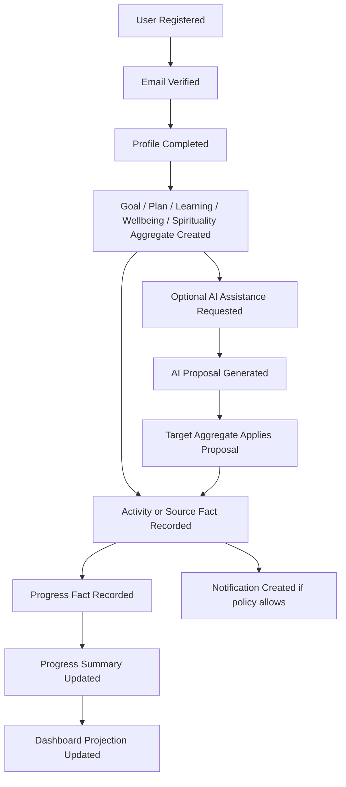

## Lifecycle Diagrams by Context

### Identity & Access

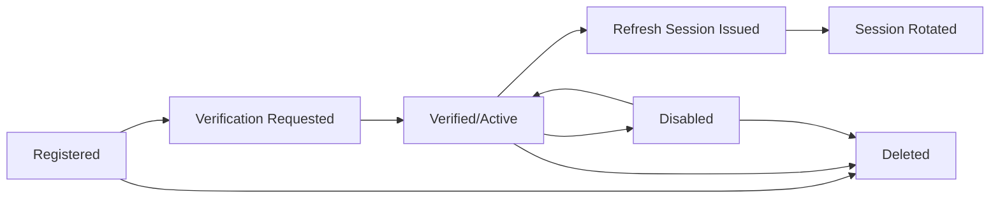

### Profile & Personalization

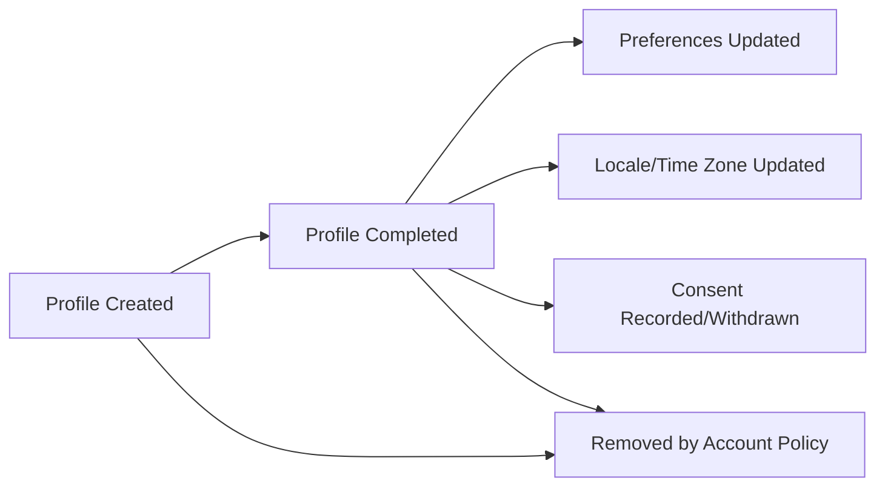

### Personal Direction

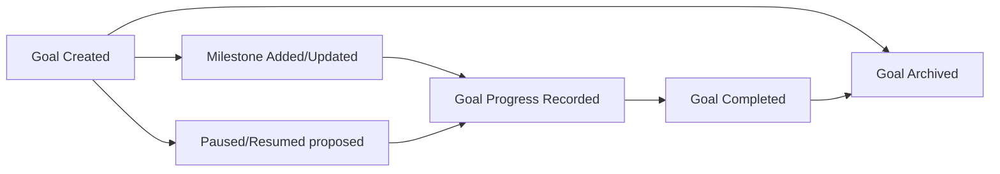

### Personal Planning

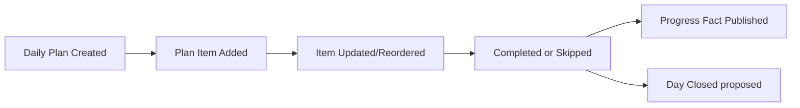

### Learning

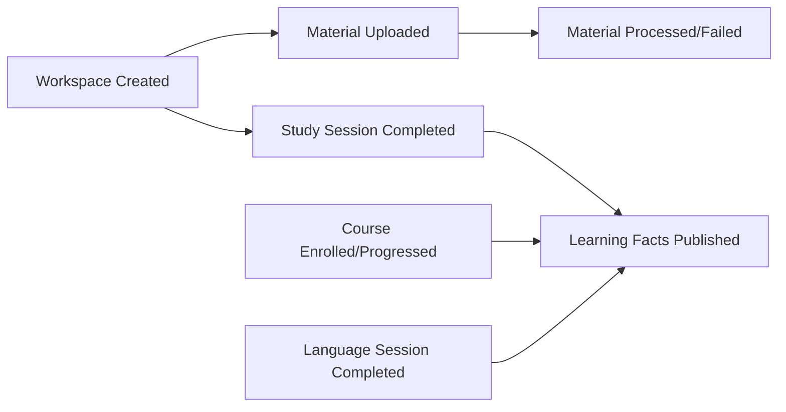

### Wellbeing

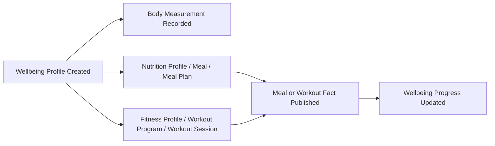

### Spirituality

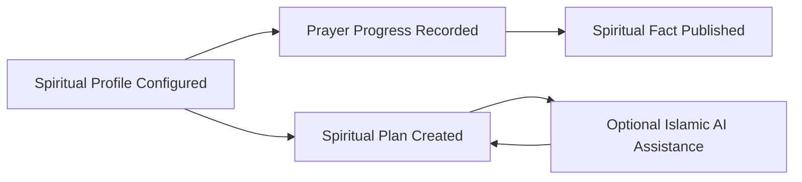

### Progress & Insights

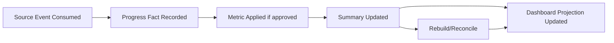

### AI Assistance

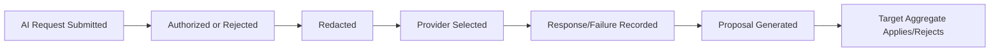

### Communications

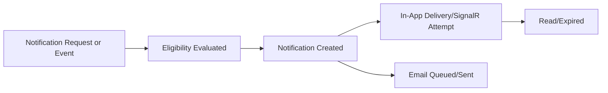

## Lifecycle Validation Report

| Check | Result |
|---|---|
| Every bounded context has lifecycle coverage | Pass |
| Lifecycle does not introduce new business rules | Pass |
| Pending lifecycle decisions marked as proposed/pending | Pass |
| AI lifecycle remains advisory/proposal-based | Pass |

## Domain Validation Report

| Validation Area | Result | Notes |
|---|---|---|
| Every approved bounded context has a domain model | Pass | Identity & Access, Profile & Personalization, Personal Direction, Personal Planning, Learning, Wellbeing, Spirituality, Progress & Insights, AI Assistance, and Communications are covered. |
| Every aggregate has root, purpose, responsibility, boundary, invariants, commands, events, entities, value objects, state, lifecycle, factory rules, and validation rules | Pass | See `01-Aggregates.md`. Pending rules are explicitly marked. |
| Every entity has identity, attributes, behavior, rules, and state changes | Pass | See `02-Entities.md`. |
| Every value object has immutability, validation, equality, and serialization guidance | Pass | See `03-ValueObjects.md`. |
| Every domain event has publisher, consumers, payload, meaning, trigger, and ordering | Pass | See `04-DomainEvents.md`. |
| Every domain service has responsibility, dependencies, and stateless behavior | Pass | See `05-DomainServices.md`. |
| State diagrams exist for aggregate state families | Pass | See `11-StateMachines.md`. |
| Lifecycle diagrams exist for every bounded context | Pass | See this document. |
| Aggregate relationship diagram exists | Pass | See `01-Aggregates.md`. |
| No duplicated aggregate ownership | Pass | Wellbeing owns body measurements, AI Assistance owns AI governance, Progress & Insights owns dashboard/progress, Communications owns notifications. |
| No shared mutable business data | Pass | Shared data is limited to identifiers, UTC instants, locale codes, and event envelopes. |
| No DDD violations left unresolved | Pass with pending gates | Potential violations were redesigned or marked pending. |

## Remaining Product Gates Before Implementation

The following are not implementation blockers for the domain model documents, but they remain blockers for code, database schema, API contracts, and tests:

- Goal lifecycle final states and reopen behavior.
- Daily plan duplicate-date, close-day, rollover, scheduling, recurrence, priority, and reminder behavior.
- Upload type, file size, malware scanning, OCR provider, and study material retention.
- Nutrition food database, units, allergies, macros, calories, medical disclaimers, and age restrictions.
- Workout exercise catalog, equipment, safety, injury, and workout metric rules.
- Prayer-time provider/calculation method, location consent, convention, and spiritual content policy.
- Language curriculum, assessment, vocabulary, and spaced-repetition rules.
- Progress metrics, streaks, achievements, rollup periods, and dashboard widget catalog.
- AI provider routing, quotas, fallback, prompt retention, redaction policy depth, and provider data-processing approval.
- Notification consent, quiet hours, reminder timing, delivery frequency, and email provider policy.
- Privacy retention, account deletion, data export, minor consent, and support access policy.
